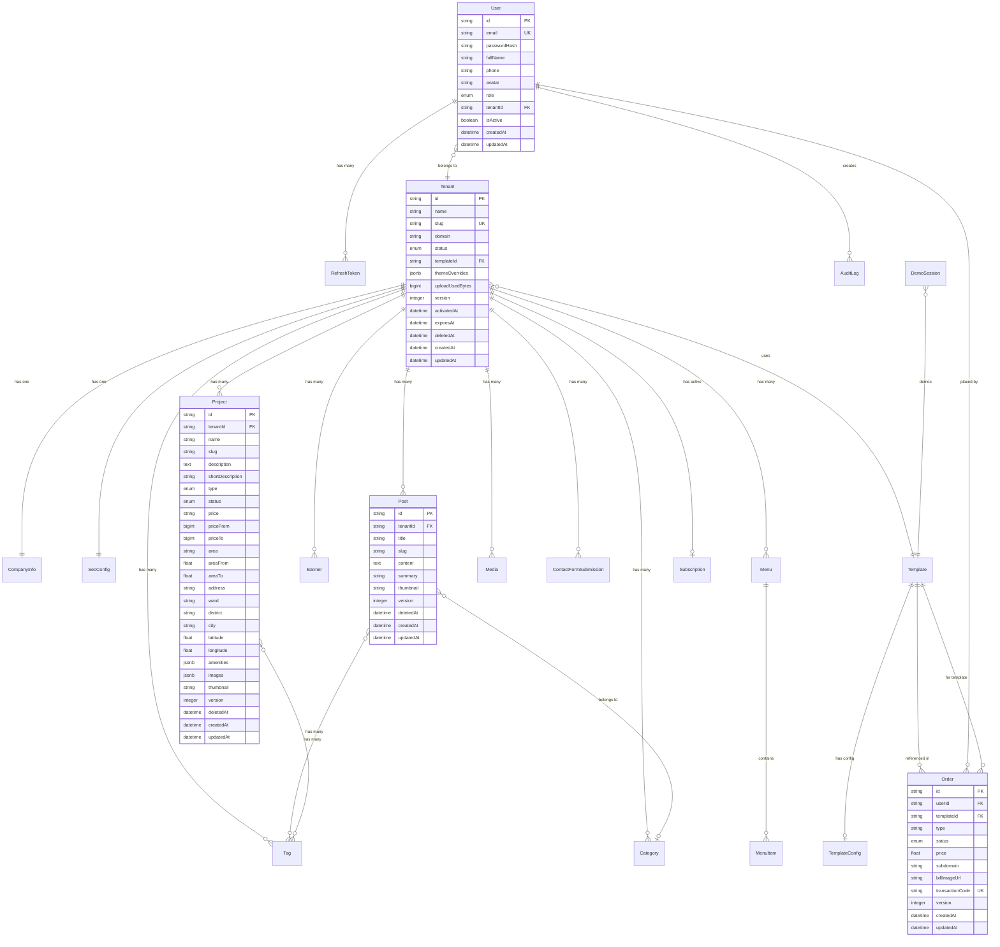

# 🗄️ Database ERD - Thiết Kế Cơ Sở Dữ Liệu (VÁ CHI TIẾT)

| Thông tin | Chi tiết |
|-----------|----------|
| **Phiên bản** | 1.0.1 (Audited & Patched) |
| **Ngày tạo** | 05/07/2026 |
| **Database** | PostgreSQL 16 |
| **ORM** | Prisma |

---

## 1. Entity Relationship Diagram (ERD) với các Bản Vá

---

## 2. Chi Tiết Các Bảng Có Bản Vá

### 2.1 Bảng `Project` (Cập nhật Soft Delete & Versioning)
- `deletedAt` (`TIMESTAMP`, Nullable): Dùng để soft delete dự án.
- `version` (`INTEGER`, Default `1`): Kiểm soát khóa lạc quan (Optimistic Locking) chống Lost Update.
- **Indexes bổ sung:**
  - `idx_project_tenant_status` -> `(tenantId, status)`
  - `idx_project_tenant_type` -> `(tenantId, type)`
  - `idx_project_tenant_published` -> `(tenantId, published)`
  - `idx_project_tenant_created` -> `(tenantId, createdAt DESC)`

### 2.2 Bảng `Post` (Cập nhật Soft Delete & Versioning)
- `deletedAt` (`TIMESTAMP`, Nullable): Phục vụ soft delete bài viết.
- `version` (`INTEGER`, Default `1`): Optimistic Locking.

### 2.3 Bảng `CompanyInfo` (Cập nhật Versioning)
- `version` (`INTEGER`, Default `1`): Phòng ngừa 2 admin cùng chỉnh sửa thông tin công ty.

### 2.4 Bảng `SeoConfig` (Cập nhật Versioning)
- `version` (`INTEGER`, Default `1`): Optimistic Locking cho cấu hình SEO global.

### 2.5 Bảng `Order` (Cập nhật Versioning & Độc nhất Giao dịch)
- `transactionCode` (`VARCHAR(100)`, Nullable, **UNIQUE**): Chặn đứng việc gửi trùng lặp mã giao dịch.
- `version` (`INTEGER`, Default `1`): Tránh race condition khi duyệt đơn hàng.
- **Không cấu hình `deletedAt`** nhằm đảm bảo tính toàn vẹn dữ liệu kế toán và kiểm toán.

### 2.6 Bảng `Tenant` (Cập nhật Soft Delete & Versioning)
- `deletedAt` (`TIMESTAMP`, Nullable): Phục vụ soft delete tenant khi hết hạn quá 30 ngày.
- `version` (`INTEGER`, Default `1`): Tránh xung đột ghi đè dữ liệu.
- `uploadUsedBytes` (`BIGINT`, Default `0`): Quản lý quota 500MB.
