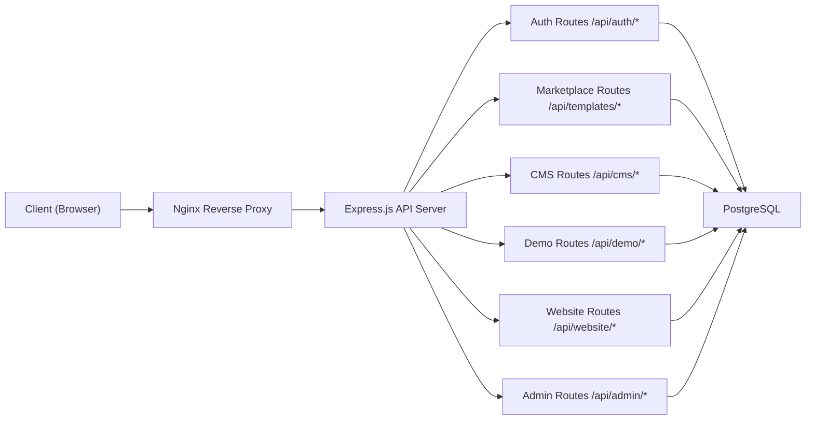

# 04 - Đặc Tả API (API Specification)

> **Phiên bản:** 1.0  
> **Ngày tạo:** 05/07/2026  
> **Tác giả:** Principal Software Architect  
> **Dự án:** Real Estate Template Marketplace & SaaS Platform

---

## Mục Lục

1. [Tổng Quan](#1-tổng-quan)
2. [Quy Ước Chung](#2-quy-ước-chung)
3. [Auth API](#3-auth-api)
4. [Marketplace API](#4-marketplace-api)
5. [CMS API](#5-cms-api)
6. [Demo API](#6-demo-api)
7. [Tenant Website API](#7-tenant-website-api)
8. [Admin API](#8-admin-api)
9. [Error Handling](#9-error-handling)

---

## 1. Tổng Quan

### 1.1. Base URL

| Môi trường   | Base URL                          |
|-------------|-----------------------------------|
| Development | `http://localhost:4000/api`        |
| Staging     | `https://api-staging.myplatform.com/api` |
| Production  | `https://api.myplatform.com/api`  |

### 1.2. Kiến Trúc API



### 1.3. Content Type

Tất cả request/response sử dụng `application/json` trừ khi có ghi chú khác (ví dụ: upload file dùng `multipart/form-data`).

### 1.4. Cấu Trúc Response Chung

```typescript
// Response thành công
interface ApiSuccessResponse<T> {
  success: true;
  data: T;
  message?: string;
}

// Response lỗi
interface ApiErrorResponse {
  success: false;
  error: {
    code: string;          // Mã lỗi nội bộ, ví dụ: 'AUTH_INVALID_CREDENTIALS'
    message: string;       // Thông báo lỗi cho developer
    details?: Record<string, string[]>; // Chi tiết lỗi validation
  };
}

// Response phân trang
interface PaginatedResponse<T> {
  success: true;
  data: T[];
  pagination: {
    page: number;
    limit: number;
    total: number;
    totalPages: number;
    hasNext: boolean;
    hasPrev: boolean;
  };
}
```

---

## 2. Quy Ước Chung

### 2.1. Authentication Header

Các endpoint yêu cầu xác thực phải gửi JWT token trong header:

```
Authorization: Bearer <access_token>
```

### 2.2. Tenant Context Header

Các endpoint CMS yêu cầu context tenant:

```
X-Tenant-Slug: <tenant_slug>
```

### 2.3. Query Parameters Phân Trang

| Param   | Type    | Default | Mô tả                                         |
|---------|---------|---------|-----------------------------------------------|
| page    | number  | 1       | Trang hiện tại                                |
| limit   | number  | 10      | Số lượng item mỗi trang (max: 100)           |
| search  | string  | -       | Từ khóa tìm kiếm                             |
| sort    | string  | -       | Trường sắp xếp, tiền tố `-` = giảm dần      |
| filter  | object  | -       | Bộ lọc tùy thuộc endpoint                    |

### 2.4. HTTP Status Codes

| Code | Ý nghĩa                       |
|------|-------------------------------|
| 200  | Thành công                    |
| 201  | Tạo mới thành công            |
| 204  | Xóa thành công (no content)   |
| 400  | Bad Request - dữ liệu không hợp lệ |
| 401  | Unauthorized - chưa đăng nhập  |
| 403  | Forbidden - không có quyền     |
| 404  | Not Found - không tìm thấy    |
| 409  | Conflict - xung đột dữ liệu   |
| 422  | Unprocessable Entity - lỗi validation |
| 429  | Too Many Requests - rate limit  |
| 500  | Internal Server Error          |

---

## 3. Auth API

### 3.1. POST /api/auth/register

**Mô tả:** Đăng ký tài khoản mới.

**Yêu cầu xác thực:** Không

**Request Headers:**

| Header       | Giá trị            | Bắt buộc |
|-------------|-------------------|---------|
| Content-Type | application/json  | Có      |

**Request Body:**

```typescript
interface RegisterRequest {
  email: string;        // Email hợp lệ, unique
  password: string;     // Tối thiểu 8 ký tự, có chữ hoa, chữ thường, số
  fullName: string;     // 2-100 ký tự
  phone?: string;       // Số điện thoại VN (10 số, bắt đầu bằng 0)
  company?: string;     // Tên công ty (nếu có)
}
```

**Response thành công (201):**

```typescript
interface RegisterResponse {
  success: true;
  data: {
    user: {
      id: string;
      email: string;
      fullName: string;
      phone: string | null;
      company: string | null;
      role: 'TENANT_ADMIN';
      createdAt: string;   // ISO 8601
    };
    tokens: {
      accessToken: string;   // JWT, hết hạn sau 15 phút
      refreshToken: string;  // JWT, hết hạn sau 7 ngày
    };
  };
  message: string;
}
```

**Response lỗi:**

| Status | Code                      | Mô tả                                    |
|--------|--------------------------|------------------------------------------|
| 400    | VALIDATION_ERROR         | Dữ liệu không hợp lệ                    |
| 409    | AUTH_EMAIL_EXISTS         | Email đã tồn tại                         |
| 429    | RATE_LIMIT_EXCEEDED      | Quá nhiều yêu cầu đăng ký               |

**Ví dụ Request:**

```json
{
  "email": "nguyenvana@gmail.com",
  "password": "MatKhau123",
  "fullName": "Nguyễn Văn A",
  "phone": "0901234567",
  "company": "Công ty TNHH BĐS Phú Thịnh"
}
```

**Ví dụ Response (201):**

```json
{
  "success": true,
  "data": {
    "user": {
      "id": "clxyz123456",
      "email": "nguyenvana@gmail.com",
      "fullName": "Nguyễn Văn A",
      "phone": "0901234567",
      "company": "Công ty TNHH BĐS Phú Thịnh",
      "role": "TENANT_ADMIN",
      "createdAt": "2026-07-05T12:00:00.000Z"
    },
    "tokens": {
      "accessToken": "eyJhbGciOiJIUzI1NiIsInR5cCI6IkpXVCJ9...",
      "refreshToken": "eyJhbGciOiJIUzI1NiIsInR5cCI6IkpXVCJ9..."
    }
  },
  "message": "Đăng ký tài khoản thành công"
}
```

**Ví dụ Response lỗi (409):**

```json
{
  "success": false,
  "error": {
    "code": "AUTH_EMAIL_EXISTS",
    "message": "Email đã được sử dụng để đăng ký tài khoản khác"
  }
}
```

---

### 3.2. POST /api/auth/login

**Mô tả:** Đăng nhập vào hệ thống.

**Yêu cầu xác thực:** Không

**Request Headers:**

| Header       | Giá trị            | Bắt buộc |
|-------------|-------------------|---------|
| Content-Type | application/json  | Có      |

**Request Body:**

```typescript
interface LoginRequest {
  email: string;
  password: string;
}
```

**Response thành công (200):**

```typescript
interface LoginResponse {
  success: true;
  data: {
    user: {
      id: string;
      email: string;
      fullName: string;
      phone: string | null;
      company: string | null;
      role: 'PLATFORM_ADMIN' | 'TENANT_ADMIN' | 'TENANT_EDITOR';
      tenantId: string | null;
      tenantSlug: string | null;
      avatar: string | null;
    };
    tokens: {
      accessToken: string;
      refreshToken: string;
    };
  };
  message: string;
}
```

**Response lỗi:**

| Status | Code                        | Mô tả                    |
|--------|-----------------------------|--------------------------|
| 400    | VALIDATION_ERROR            | Dữ liệu không hợp lệ    |
| 401    | AUTH_INVALID_CREDENTIALS    | Email hoặc mật khẩu sai  |
| 403    | AUTH_ACCOUNT_DISABLED       | Tài khoản đã bị khóa     |

**Ví dụ Request:**

```json
{
  "email": "nguyenvana@gmail.com",
  "password": "MatKhau123"
}
```

**Ví dụ Response (200):**

```json
{
  "success": true,
  "data": {
    "user": {
      "id": "clxyz123456",
      "email": "nguyenvana@gmail.com",
      "fullName": "Nguyễn Văn A",
      "phone": "0901234567",
      "company": "Công ty TNHH BĐS Phú Thịnh",
      "role": "TENANT_ADMIN",
      "tenantId": "tenant_abc123",
      "tenantSlug": "phu-thinh-land",
      "avatar": null
    },
    "tokens": {
      "accessToken": "eyJhbGciOiJIUzI1NiIsInR5cCI6IkpXVCJ9...",
      "refreshToken": "eyJhbGciOiJIUzI1NiIsInR5cCI6IkpXVCJ9..."
    }
  },
  "message": "Đăng nhập thành công"
}
```

---

### 3.3. POST /api/auth/refresh

**Mô tả:** Làm mới access token bằng refresh token.

**Yêu cầu xác thực:** Không (dùng refresh token)

**Request Body:**

```typescript
interface RefreshTokenRequest {
  refreshToken: string;
}
```

**Response thành công (200):**

```typescript
interface RefreshTokenResponse {
  success: true;
  data: {
    tokens: {
      accessToken: string;
      refreshToken: string;  // Refresh token mới (rotation)
    };
  };
}
```

**Response lỗi:**

| Status | Code                          | Mô tả                         |
|--------|-------------------------------|-------------------------------|
| 401    | AUTH_REFRESH_TOKEN_EXPIRED    | Refresh token đã hết hạn      |
| 401    | AUTH_REFRESH_TOKEN_INVALID    | Refresh token không hợp lệ    |
| 401    | AUTH_REFRESH_TOKEN_REVOKED    | Refresh token đã bị thu hồi   |

**Ví dụ Request:**

```json
{
  "refreshToken": "eyJhbGciOiJIUzI1NiIsInR5cCI6IkpXVCJ9..."
}
```

**Ví dụ Response (200):**

```json
{
  "success": true,
  "data": {
    "tokens": {
      "accessToken": "eyJhbGciOiJIUzI1NiIsInR5cCI6IkpXVCJ9.newtoken...",
      "refreshToken": "eyJhbGciOiJIUzI1NiIsInR5cCI6IkpXVCJ9.newrefresh..."
    }
  }
}
```

---

### 3.4. POST /api/auth/logout

**Mô tả:** Đăng xuất, thu hồi refresh token.

**Yêu cầu xác thực:** Có (Bearer token)

**Request Headers:**

| Header        | Giá trị               | Bắt buộc |
|--------------|----------------------|---------|
| Authorization | Bearer \<token\>     | Có      |
| Content-Type  | application/json     | Có      |

**Request Body:**

```typescript
interface LogoutRequest {
  refreshToken: string;
}
```

**Response thành công (200):**

```json
{
  "success": true,
  "message": "Đăng xuất thành công"
}
```

**Response lỗi:**

| Status | Code                  | Mô tả                |
|--------|----------------------|----------------------|
| 401    | AUTH_UNAUTHORIZED    | Chưa đăng nhập       |

---

### 3.5. POST /api/auth/forgot-password

**Mô tả:** Gửi email đặt lại mật khẩu. Tạo token reset có thời hạn 1 giờ.

**Yêu cầu xác thực:** Không

**Request Body:**

```typescript
interface ForgotPasswordRequest {
  email: string;
}
```

**Response thành công (200):**

```json
{
  "success": true,
  "message": "Nếu email tồn tại trong hệ thống, bạn sẽ nhận được email hướng dẫn đặt lại mật khẩu"
}
```

> **Lưu ý bảo mật:** Response luôn trả về 200 bất kể email có tồn tại hay không để tránh lộ thông tin người dùng (user enumeration).

**Response lỗi:**

| Status | Code                  | Mô tả                               |
|--------|----------------------|-------------------------------------|
| 429    | RATE_LIMIT_EXCEEDED  | Quá nhiều yêu cầu (max 3/giờ/email) |

**Ví dụ Request:**

```json
{
  "email": "nguyenvana@gmail.com"
}
```

---

### 3.6. POST /api/auth/reset-password

**Mô tả:** Đặt lại mật khẩu bằng token đã gửi qua email.

**Yêu cầu xác thực:** Không (dùng reset token)

**Request Body:**

```typescript
interface ResetPasswordRequest {
  token: string;         // Token từ email
  newPassword: string;   // Mật khẩu mới, tối thiểu 8 ký tự
}
```

**Response thành công (200):**

```json
{
  "success": true,
  "message": "Đặt lại mật khẩu thành công. Vui lòng đăng nhập với mật khẩu mới"
}
```

**Response lỗi:**

| Status | Code                          | Mô tả                          |
|--------|-------------------------------|---------------------------------|
| 400    | AUTH_RESET_TOKEN_INVALID      | Token không hợp lệ              |
| 400    | AUTH_RESET_TOKEN_EXPIRED      | Token đã hết hạn (1 giờ)        |
| 400    | VALIDATION_ERROR              | Mật khẩu không đủ mạnh          |

---

## 4. Marketplace API

### 4.1. GET /api/templates

**Mô tả:** Lấy danh sách templates với bộ lọc và phân trang.

**Yêu cầu xác thực:** Không

**Query Parameters:**

| Param    | Type    | Default      | Mô tả                                         |
|----------|---------|-------------|-----------------------------------------------|
| page     | number  | 1           | Trang hiện tại                                |
| limit    | number  | 12          | Số template mỗi trang                         |
| search   | string  | -           | Tìm theo tên template                         |
| category | string  | -           | Lọc theo danh mục: luxury, modern, minimal    |
| priceMin | number  | -           | Giá tối thiểu (VNĐ)                          |
| priceMax | number  | -           | Giá tối đa (VNĐ)                             |
| sort     | string  | -createdAt  | Sắp xếp: price, -price, name, -name, popular |
| type     | string  | -           | Loại: buy, rent, all                          |

**Response thành công (200):**

```typescript
interface Template {
  id: string;
  name: string;
  slug: string;
  description: string;
  shortDescription: string;
  thumbnail: string;           // Cloudinary URL
  previewImages: string[];     // Mảng ảnh preview
  demoUrl: string;             // URL xem demo
  category: string;
  features: string[];          // Danh sách tính năng
  techStack: string[];
  priceBuy: number | null;     // Giá mua (VNĐ), null nếu không hỗ trợ
  priceRentMonthly: number | null;  // Giá thuê/tháng
  themeConfig: {
    primaryColor: string;
    secondaryColor: string;
    fontFamily: string;
    style: string;
  };
  version: string;
  isActive: boolean;
  isFeatured: boolean;
  createdAt: string;
  updatedAt: string;
}

interface TemplateListResponse {
  success: true;
  data: Template[];
  pagination: {
    page: number;
    limit: number;
    total: number;
    totalPages: number;
    hasNext: boolean;
    hasPrev: boolean;
  };
}
```

**Ví dụ Request:**

```
GET /api/templates?page=1&limit=12&category=luxury&sort=-price
```

**Ví dụ Response (200):**

```json
{
  "success": true,
  "data": [
    {
      "id": "tpl_001",
      "name": "Luxury Gold",
      "slug": "luxury-gold",
      "description": "Template bất động sản cao cấp với phong cách sang trọng, tone vàng đồng kết hợp trắng tinh tế.",
      "shortDescription": "Phong cách sang trọng, tone vàng đồng",
      "thumbnail": "https://res.cloudinary.com/myplatform/image/upload/templates/luxury-gold-thumb.jpg",
      "previewImages": [
        "https://res.cloudinary.com/myplatform/image/upload/templates/luxury-gold-1.jpg",
        "https://res.cloudinary.com/myplatform/image/upload/templates/luxury-gold-2.jpg"
      ],
      "demoUrl": "https://demo-luxury-gold.myplatform.com",
      "category": "luxury",
      "features": ["Responsive", "SEO Optimized", "Fast Loading", "CMS tích hợp"],
      "techStack": ["Next.js", "TailwindCSS", "Prisma"],
      "priceBuy": 5000000,
      "priceRentMonthly": 500000,
      "themeConfig": {
        "primaryColor": "#C9A84C",
        "secondaryColor": "#1A1A2E",
        "fontFamily": "Playfair Display",
        "style": "luxury"
      },
      "version": "1.0.0",
      "isActive": true,
      "isFeatured": true,
      "createdAt": "2026-07-01T00:00:00.000Z",
      "updatedAt": "2026-07-05T00:00:00.000Z"
    }
  ],
  "pagination": {
    "page": 1,
    "limit": 12,
    "total": 3,
    "totalPages": 1,
    "hasNext": false,
    "hasPrev": false
  }
}
```

---

### 4.2. GET /api/templates/:slug

**Mô tả:** Lấy chi tiết một template theo slug.

**Yêu cầu xác thực:** Không

**Path Parameters:**

| Param | Type   | Mô tả          |
|-------|--------|----------------|
| slug  | string | Slug của template |

**Response thành công (200):**

```typescript
interface TemplateDetailResponse {
  success: true;
  data: Template & {
    fullDescription: string;     // HTML chi tiết
    changelog: {
      version: string;
      date: string;
      changes: string[];
    }[];
    relatedTemplates: Pick<Template, 'id' | 'name' | 'slug' | 'thumbnail' | 'priceBuy' | 'priceRentMonthly'>[];
    stats: {
      totalPurchases: number;
      totalRentals: number;
      avgRating: number;
    };
  };
}
```

**Response lỗi:**

| Status | Code             | Mô tả                    |
|--------|-----------------|--------------------------|
| 404    | TEMPLATE_NOT_FOUND | Template không tồn tại   |

**Ví dụ Request:**

```
GET /api/templates/luxury-gold
```

---

### 4.3. POST /api/quotations

**Mô tả:** Gửi yêu cầu báo giá / đặt mua template. Tạo bản ghi Order với status PENDING.

**Yêu cầu xác thực:** Không (nhưng nếu đã đăng nhập sẽ gắn userId)

**Request Body:**

```typescript
interface QuotationRequest {
  templateId: string;
  type: 'BUY' | 'RENT';       // Mua source hoặc thuê website
  fullName: string;
  email: string;
  phone: string;
  company?: string;
  message?: string;            // Ghi chú, yêu cầu thêm
  desiredSubdomain?: string;   // Subdomain mong muốn (cho RENT)
}
```

**Response thành công (201):**

```typescript
interface QuotationResponse {
  success: true;
  data: {
    orderId: string;
    orderCode: string;         // Mã đơn hàng: ORD-20260705-001
    templateName: string;
    type: 'BUY' | 'RENT';
    estimatedPrice: number;
    status: 'PENDING';
    message: string;
  };
  message: string;
}
```

**Ví dụ Request:**

```json
{
  "templateId": "tpl_001",
  "type": "RENT",
  "fullName": "Trần Thị B",
  "email": "tranthib@gmail.com",
  "phone": "0912345678",
  "company": "BĐS Trần Thị",
  "message": "Tôi muốn thuê website với subdomain bds-tranthib",
  "desiredSubdomain": "bds-tranthib"
}
```

**Ví dụ Response (201):**

```json
{
  "success": true,
  "data": {
    "orderId": "ord_xyz789",
    "orderCode": "ORD-20260705-001",
    "templateName": "Luxury Gold",
    "type": "RENT",
    "estimatedPrice": 500000,
    "status": "PENDING",
    "message": "Đội ngũ sẽ liên hệ bạn trong vòng 24 giờ"
  },
  "message": "Gửi yêu cầu báo giá thành công. Chúng tôi sẽ liên hệ bạn sớm nhất."
}
```

---

### 4.4. POST /api/contact

**Mô tả:** Gửi form liên hệ từ trang Marketplace.

**Yêu cầu xác thực:** Không

**Request Body:**

```typescript
interface ContactRequest {
  fullName: string;
  email: string;
  phone?: string;
  subject: string;
  message: string;
  captchaToken?: string;   // Google reCAPTCHA token (Phase 2)
}
```

**Response thành công (201):**

```json
{
  "success": true,
  "message": "Cảm ơn bạn đã liên hệ. Chúng tôi sẽ phản hồi trong thời gian sớm nhất."
}
```

**Response lỗi:**

| Status | Code                  | Mô tả                          |
|--------|----------------------|---------------------------------|
| 400    | VALIDATION_ERROR     | Dữ liệu không hợp lệ           |
| 429    | RATE_LIMIT_EXCEEDED  | Quá nhiều yêu cầu (max 5/giờ)  |

---

## 5. CMS API

> **Lưu ý:** Tất cả CMS API yêu cầu:
> - Header `Authorization: Bearer <access_token>`
> - Header `X-Tenant-Slug: <tenant_slug>` (tự động xác định tenant từ user nếu không truyền)
> - Role: `TENANT_ADMIN` hoặc `TENANT_EDITOR`

### 5.1. GET /api/cms/dashboard/stats

**Mô tả:** Lấy thống kê tổng quan cho dashboard CMS.

**Yêu cầu xác thực:** Có (TENANT_ADMIN, TENANT_EDITOR)

**Response thành công (200):**

```typescript
interface DashboardStats {
  success: true;
  data: {
    totalProjects: number;
    totalPosts: number;
    totalMedia: number;
    totalContactSubmissions: number;
    recentContacts: {
      id: string;
      fullName: string;
      email: string;
      subject: string;
      createdAt: string;
    }[];
    projectsByStatus: {
      COMING_SOON: number;
      SELLING: number;
      SOLD_OUT: number;
    };
    websiteInfo: {
      subdomain: string;
      templateName: string;
      isActive: boolean;
      expiresAt: string | null;
    };
  };
}
```

**Ví dụ Response (200):**

```json
{
  "success": true,
  "data": {
    "totalProjects": 12,
    "totalPosts": 8,
    "totalMedia": 45,
    "totalContactSubmissions": 23,
    "recentContacts": [
      {
        "id": "contact_001",
        "fullName": "Lê Văn C",
        "email": "levanc@gmail.com",
        "subject": "Hỏi thông tin dự án Vinhomes Grand Park",
        "createdAt": "2026-07-05T10:30:00.000Z"
      }
    ],
    "projectsByStatus": {
      "COMING_SOON": 3,
      "SELLING": 7,
      "SOLD_OUT": 2
    },
    "websiteInfo": {
      "subdomain": "phu-thinh-land",
      "templateName": "Luxury Gold",
      "isActive": true,
      "expiresAt": "2026-08-05T00:00:00.000Z"
    }
  }
}
```

---

### 5.2. CRUD /api/cms/projects

#### 5.2.1. GET /api/cms/projects

**Mô tả:** Lấy danh sách dự án BĐS của tenant.

**Query Parameters:**

| Param    | Type    | Default      | Mô tả                                    |
|----------|---------|-------------|------------------------------------------|
| page     | number  | 1           | Trang hiện tại                            |
| limit    | number  | 10          | Số lượng mỗi trang                       |
| search   | string  | -           | Tìm theo tên dự án                       |
| status   | string  | -           | COMING_SOON, SELLING, SOLD_OUT           |
| type     | string  | -           | APARTMENT, VILLA, TOWNHOUSE, LAND, COMMERCIAL, OFFICE |
| city     | string  | -           | Lọc theo thành phố                       |
| featured | boolean | -           | Lọc dự án nổi bật                        |
| published| boolean | -           | Lọc trạng thái xuất bản                  |
| sort     | string  | -createdAt  | Sắp xếp: name, price, createdAt, sortOrder |

**Response thành công (200):**

```typescript
interface Project {
  id: string;
  tenantId: string;
  name: string;
  slug: string;
  description: string;
  shortDescription: string;
  type: 'APARTMENT' | 'VILLA' | 'TOWNHOUSE' | 'LAND' | 'COMMERCIAL' | 'OFFICE';
  status: 'COMING_SOON' | 'SELLING' | 'SOLD_OUT';
  price: string;               // Hiển thị: "Từ 2.5 tỷ"
  priceFrom: number | null;    // 2500000000
  priceTo: number | null;      // 5000000000
  area: string;                // Hiển thị: "65 - 120 m²"
  areaFrom: number | null;     // 65
  areaTo: number | null;       // 120
  address: string;
  ward: string;
  district: string;
  city: string;
  latitude: number | null;
  longitude: number | null;
  investor: string;
  developer: string | null;
  constructionYear: number | null;
  handoverDate: string | null;
  totalUnits: number | null;
  amenities: string[];
  images: string[];
  thumbnail: string;
  floorPlans: string[];
  documents: string[];
  youtubeUrl: string | null;
  virtualTourUrl: string | null;
  featured: boolean;
  sortOrder: number;
  seoTitle: string | null;
  seoDescription: string | null;
  seoKeywords: string[];
  published: boolean;
  createdAt: string;
  updatedAt: string;
}

type ProjectListResponse = PaginatedResponse<Project>;
```

**Ví dụ Response (200):**

```json
{
  "success": true,
  "data": [
    {
      "id": "proj_001",
      "tenantId": "tenant_abc123",
      "name": "Vinhomes Grand Park",
      "slug": "vinhomes-grand-park",
      "shortDescription": "Đại đô thị đẳng cấp phía Đông TP.HCM",
      "type": "APARTMENT",
      "status": "SELLING",
      "price": "Từ 2.5 tỷ",
      "priceFrom": 2500000000,
      "priceTo": 5000000000,
      "thumbnail": "https://res.cloudinary.com/myplatform/image/upload/projects/vinhomes-gp.jpg",
      "featured": true,
      "published": true,
      "createdAt": "2026-07-01T00:00:00.000Z"
    }
  ],
  "pagination": {
    "page": 1,
    "limit": 10,
    "total": 12,
    "totalPages": 2,
    "hasNext": true,
    "hasPrev": false
  }
}
```

#### 5.2.2. GET /api/cms/projects/:id

**Mô tả:** Lấy chi tiết một dự án.

**Path Parameters:** `id` - ID của dự án

**Response (200):** Trả về object `Project` đầy đủ tất cả trường.

#### 5.2.3. POST /api/cms/projects

**Mô tả:** Tạo dự án BĐS mới.

**Yêu cầu xác thực:** Có (TENANT_ADMIN)

**Request Body:**

```typescript
interface CreateProjectRequest {
  name: string;                 // Bắt buộc, 5-200 ký tự
  description: string;          // Bắt buộc, HTML content
  shortDescription: string;     // Bắt buộc, max 500 ký tự
  type: 'APARTMENT' | 'VILLA' | 'TOWNHOUSE' | 'LAND' | 'COMMERCIAL' | 'OFFICE';
  status: 'COMING_SOON' | 'SELLING' | 'SOLD_OUT';
  price: string;
  priceFrom?: number;
  priceTo?: number;
  area?: string;
  areaFrom?: number;
  areaTo?: number;
  address: string;              // Bắt buộc
  ward?: string;
  district?: string;
  city: string;                 // Bắt buộc
  latitude?: number;
  longitude?: number;
  investor?: string;
  developer?: string;
  constructionYear?: number;
  handoverDate?: string;        // ISO date
  totalUnits?: number;
  amenities?: string[];
  images?: string[];            // Cloudinary URLs
  thumbnail?: string;
  floorPlans?: string[];
  documents?: string[];
  youtubeUrl?: string;
  virtualTourUrl?: string;
  featured?: boolean;
  sortOrder?: number;
  seoTitle?: string;
  seoDescription?: string;
  seoKeywords?: string[];
  published?: boolean;          // Default: false
}
```

**Response thành công (201):** Trả về object `Project` đã tạo.

**Response lỗi:**

| Status | Code                   | Mô tả                       |
|--------|------------------------|------------------------------|
| 400    | VALIDATION_ERROR       | Dữ liệu không hợp lệ        |
| 401    | AUTH_UNAUTHORIZED      | Chưa đăng nhập               |
| 403    | AUTH_FORBIDDEN         | Không có quyền (EDITOR)      |
| 409    | PROJECT_SLUG_EXISTS    | Slug dự án đã tồn tại        |

#### 5.2.4. PUT /api/cms/projects/:id

**Mô tả:** Cập nhật dự án BĐS.

**Request Body:** Tương tự `CreateProjectRequest`, tất cả trường đều optional (partial update).

**Response thành công (200):** Trả về object `Project` đã cập nhật.

**Response lỗi:**

| Status | Code              | Mô tả                |
|--------|-------------------|-----------------------|
| 404    | PROJECT_NOT_FOUND | Dự án không tồn tại   |

#### 5.2.5. DELETE /api/cms/projects/:id

**Mô tả:** Xóa dự án BĐS (soft delete).

**Yêu cầu xác thực:** Có (TENANT_ADMIN)

**Response thành công (204):** No content.

**Response lỗi:**

| Status | Code              | Mô tả                |
|--------|-------------------|-----------------------|
| 404    | PROJECT_NOT_FOUND | Dự án không tồn tại   |

---

### 5.3. CRUD /api/cms/posts

#### 5.3.1. GET /api/cms/posts

**Mô tả:** Lấy danh sách bài viết blog.

**Query Parameters:**

| Param      | Type    | Default      | Mô tả                       |
|-----------|---------|-------------|------------------------------|
| page      | number  | 1           | Trang hiện tại               |
| limit     | number  | 10          | Số lượng mỗi trang           |
| search    | string  | -           | Tìm theo tiêu đề            |
| categoryId| string  | -           | Lọc theo danh mục            |
| published | boolean | -           | Lọc trạng thái xuất bản      |
| sort      | string  | -createdAt  | Sắp xếp                     |

**Response thành công (200):**

```typescript
interface Post {
  id: string;
  tenantId: string;
  title: string;
  slug: string;
  excerpt: string;          // Mô tả ngắn
  content: string;          // HTML content
  thumbnail: string | null;
  categoryId: string | null;
  category: {
    id: string;
    name: string;
    slug: string;
  } | null;
  tags: string[];
  author: {
    id: string;
    fullName: string;
    avatar: string | null;
  };
  seoTitle: string | null;
  seoDescription: string | null;
  published: boolean;
  publishedAt: string | null;
  viewCount: number;
  createdAt: string;
  updatedAt: string;
}

type PostListResponse = PaginatedResponse<Post>;
```

#### 5.3.2. POST /api/cms/posts

**Request Body:**

```typescript
interface CreatePostRequest {
  title: string;            // Bắt buộc, 5-200 ký tự
  content: string;          // Bắt buộc, HTML
  excerpt?: string;         // Max 500 ký tự, auto-generate nếu không có
  thumbnail?: string;       // Cloudinary URL
  categoryId?: string;
  tags?: string[];
  seoTitle?: string;
  seoDescription?: string;
  published?: boolean;      // Default: false
}
```

**Response thành công (201):** Trả về object `Post`.

#### 5.3.3. PUT /api/cms/posts/:id

**Request Body:** Partial update, tương tự `CreatePostRequest`.

#### 5.3.4. DELETE /api/cms/posts/:id

**Response (204):** No content.

---

### 5.4. CRUD /api/cms/categories

#### 5.4.1. GET /api/cms/categories

**Mô tả:** Lấy danh sách danh mục bài viết.

**Response (200):**

```typescript
interface Category {
  id: string;
  tenantId: string;
  name: string;
  slug: string;
  description: string | null;
  parentId: string | null;
  sortOrder: number;
  postCount: number;        // Số bài viết trong danh mục
  createdAt: string;
}

interface CategoryListResponse {
  success: true;
  data: Category[];
}
```

#### 5.4.2. POST /api/cms/categories

**Request Body:**

```typescript
interface CreateCategoryRequest {
  name: string;            // Bắt buộc
  description?: string;
  parentId?: string;       // ID danh mục cha (hỗ trợ 2 cấp)
  sortOrder?: number;
}
```

#### 5.4.3. PUT /api/cms/categories/:id

**Request Body:** Partial update.

#### 5.4.4. DELETE /api/cms/categories/:id

**Response (204):** No content. Bài viết trong danh mục sẽ được set `categoryId = null`.

---

### 5.5. CRUD /api/cms/banners

#### 5.5.1. GET /api/cms/banners

**Mô tả:** Lấy danh sách banner/slider.

**Response (200):**

```typescript
interface Banner {
  id: string;
  tenantId: string;
  title: string;
  subtitle: string | null;
  imageUrl: string;          // Cloudinary URL
  mobileImageUrl: string | null;
  linkUrl: string | null;
  linkTarget: '_self' | '_blank';
  buttonText: string | null;
  position: 'HOME_HERO' | 'HOME_MIDDLE' | 'PROJECT_PAGE' | 'BLOG_PAGE';
  sortOrder: number;
  isActive: boolean;
  startDate: string | null;
  endDate: string | null;
  createdAt: string;
  updatedAt: string;
}

interface BannerListResponse {
  success: true;
  data: Banner[];
}
```

#### 5.5.2. POST /api/cms/banners

**Request Body:**

```typescript
interface CreateBannerRequest {
  title: string;               // Bắt buộc
  subtitle?: string;
  imageUrl: string;            // Bắt buộc, Cloudinary URL
  mobileImageUrl?: string;
  linkUrl?: string;
  linkTarget?: '_self' | '_blank';
  buttonText?: string;
  position: 'HOME_HERO' | 'HOME_MIDDLE' | 'PROJECT_PAGE' | 'BLOG_PAGE';
  sortOrder?: number;
  isActive?: boolean;          // Default: true
  startDate?: string;
  endDate?: string;
}
```

#### 5.5.3. PUT /api/cms/banners/:id

**Request Body:** Partial update.

#### 5.5.4. DELETE /api/cms/banners/:id

**Response (204):** No content.

---

### 5.6. CRUD /api/cms/menus

#### 5.6.1. GET /api/cms/menus

**Mô tả:** Lấy danh sách menu items (tree structure).

**Response (200):**

```typescript
interface MenuItem {
  id: string;
  tenantId: string;
  label: string;
  url: string;
  target: '_self' | '_blank';
  parentId: string | null;
  sortOrder: number;
  isActive: boolean;
  icon: string | null;
  menuType: 'HEADER' | 'FOOTER';
  children: MenuItem[];       // Menu con (max 2 cấp)
  createdAt: string;
}

interface MenuListResponse {
  success: true;
  data: {
    header: MenuItem[];
    footer: MenuItem[];
  };
}
```

#### 5.6.2. POST /api/cms/menus

**Request Body:**

```typescript
interface CreateMenuItemRequest {
  label: string;
  url: string;
  target?: '_self' | '_blank';
  parentId?: string;
  sortOrder?: number;
  isActive?: boolean;
  icon?: string;
  menuType: 'HEADER' | 'FOOTER';
}
```

#### 5.6.3. PUT /api/cms/menus/:id

**Request Body:** Partial update.

#### 5.6.4. PUT /api/cms/menus/reorder

**Mô tả:** Sắp xếp lại thứ tự menu.

**Request Body:**

```typescript
interface ReorderMenuRequest {
  items: {
    id: string;
    sortOrder: number;
    parentId: string | null;
  }[];
}
```

#### 5.6.5. DELETE /api/cms/menus/:id

**Response (204):** Xóa menu item và tất cả children.

---

### 5.7. PUT /api/cms/company-info

**Mô tả:** Cập nhật thông tin công ty/cá nhân. Mỗi tenant chỉ có 1 bản ghi company info (upsert).

**Yêu cầu xác thực:** Có (TENANT_ADMIN)

**Request Body:**

```typescript
interface CompanyInfoRequest {
  name: string;
  shortName?: string;
  description?: string;
  logo: string;                  // Cloudinary URL
  logoDark?: string;             // Logo trên nền tối
  favicon?: string;
  email: string;
  phone: string;
  hotline?: string;
  address: string;
  ward?: string;
  district?: string;
  city?: string;
  taxCode?: string;
  foundedYear?: number;
  employeeCount?: string;
  slogan?: string;
  aboutContent?: string;         // HTML
  socialLinks?: {
    facebook?: string;
    youtube?: string;
    zalo?: string;
    tiktok?: string;
    instagram?: string;
    linkedin?: string;
  };
  workingHours?: string;          // "T2 - T7: 8:00 - 17:30"
  googleMapEmbed?: string;        // Google Maps iframe URL
  latitude?: number;
  longitude?: number;
}
```

**Response thành công (200):**

```typescript
interface CompanyInfo extends CompanyInfoRequest {
  id: string;
  tenantId: string;
  createdAt: string;
  updatedAt: string;
}
```

**GET /api/cms/company-info:** Lấy thông tin company info hiện tại (200).

---

### 5.8. PUT /api/cms/seo-config

**Mô tả:** Cập nhật cấu hình SEO mặc định cho website.

**Request Body:**

```typescript
interface SeoConfigRequest {
  siteTitle: string;             // "BĐS Phú Thịnh - Bất động sản uy tín"
  siteDescription: string;
  siteKeywords: string[];
  ogImage: string | null;        // Default OG image
  favicon: string | null;
  googleAnalyticsId?: string;
  googleSearchConsoleId?: string;
  facebookPixelId?: string;
  robotsTxt?: string;            // Custom robots.txt
  customHeadScripts?: string;    // Custom scripts inject vào <head>
}
```

**GET /api/cms/seo-config:** Lấy cấu hình SEO hiện tại (200).

---

### 5.9. CRUD /api/cms/media

#### 5.9.1. GET /api/cms/media

**Mô tả:** Lấy danh sách media đã upload.

**Query Parameters:**

| Param | Type   | Default     | Mô tả                           |
|-------|--------|------------|----------------------------------|
| page  | number | 1          | Trang                            |
| limit | number | 20         | Số lượng                         |
| type  | string | -          | image, video, document           |
| search| string | -          | Tìm theo tên file               |
| sort  | string | -createdAt | Sắp xếp                         |

**Response (200):**

```typescript
interface Media {
  id: string;
  tenantId: string;
  filename: string;
  originalName: string;
  url: string;              // Cloudinary URL
  thumbnailUrl: string;     // Thumbnail URL (tự tạo bởi Cloudinary)
  type: 'IMAGE' | 'VIDEO' | 'DOCUMENT';
  mimeType: string;
  size: number;             // bytes
  width: number | null;     // pixels (cho ảnh)
  height: number | null;
  cloudinaryId: string;     // Public ID trên Cloudinary
  alt: string | null;       // Alt text cho SEO
  folder: string;           // Thư mục trên Cloudinary
  createdAt: string;
}

type MediaListResponse = PaginatedResponse<Media>;
```

#### 5.9.2. POST /api/cms/media/upload

**Mô tả:** Upload file media lên Cloudinary.

**Content-Type:** `multipart/form-data`

**Request Body:**

| Field  | Type   | Mô tả                                     |
|--------|--------|-------------------------------------------|
| file   | File   | File upload (max 10MB ảnh, 50MB video)    |
| folder | string | Thư mục: projects, posts, banners, general |
| alt    | string | Alt text (optional)                       |

**Response thành công (201):**

```json
{
  "success": true,
  "data": {
    "id": "media_001",
    "filename": "vinhomes-gp.jpg",
    "url": "https://res.cloudinary.com/myplatform/image/upload/v1/tenants/phu-thinh-land/projects/vinhomes-gp.jpg",
    "thumbnailUrl": "https://res.cloudinary.com/myplatform/image/upload/c_thumb,w_200,h_200/v1/tenants/phu-thinh-land/projects/vinhomes-gp.jpg",
    "type": "IMAGE",
    "size": 245760,
    "width": 1920,
    "height": 1080
  },
  "message": "Upload thành công"
}
```

**Response lỗi:**

| Status | Code                | Mô tả                            |
|--------|--------------------|------------------------------------|
| 400    | MEDIA_INVALID_TYPE | Loại file không được hỗ trợ       |
| 400    | MEDIA_TOO_LARGE    | File vượt quá kích thước cho phép  |
| 500    | CLOUDINARY_ERROR   | Lỗi upload lên Cloudinary         |

#### 5.9.3. DELETE /api/cms/media/:id

**Mô tả:** Xóa file media (xóa cả trên Cloudinary).

**Response (204):** No content.

---

### 5.10. GET /api/cms/contact-submissions

**Mô tả:** Lấy danh sách form liên hệ đã gửi từ website tenant.

**Query Parameters:**

| Param  | Type    | Default      | Mô tả                     |
|--------|---------|-------------|---------------------------|
| page   | number  | 1           | Trang                     |
| limit  | number  | 10          | Số lượng                  |
| search | string  | -           | Tìm theo tên, email       |
| isRead | boolean | -           | Lọc đã đọc/chưa đọc      |
| sort   | string  | -createdAt  | Sắp xếp                  |

**Response (200):**

```typescript
interface ContactSubmission {
  id: string;
  tenantId: string;
  fullName: string;
  email: string;
  phone: string | null;
  subject: string;
  message: string;
  projectId: string | null;
  projectName: string | null;
  source: string;             // Trang gửi: "contact_page", "project_detail"
  isRead: boolean;
  readAt: string | null;
  createdAt: string;
}

type ContactSubmissionListResponse = PaginatedResponse<ContactSubmission>;
```

#### PUT /api/cms/contact-submissions/:id/read

**Mô tả:** Đánh dấu đã đọc.

**Response (200):**

```json
{
  "success": true,
  "message": "Đã đánh dấu đã đọc"
}
```

---

## 6. Demo API

### 6.1. POST /api/demo/sessions

**Mô tả:** Tạo phiên demo mới. Cookie session cho anonymous user. Giới hạn 3 lần lưu hoặc 3 ngày.

**Yêu cầu xác thực:** Không (dùng cookie session)

**Request Body:**

```typescript
interface CreateDemoSessionRequest {
  templateId: string;
}
```

**Response thành công (201):**

```typescript
interface DemoSession {
  id: string;
  templateId: string;
  sessionToken: string;       // Lưu vào cookie
  customizations: {
    logo: string | null;
    primaryColor: string;
    secondaryColor: string;
    bannerImage: string | null;
    bannerTitle: string | null;
    bannerSubtitle: string | null;
    companyName: string | null;
    companyPhone: string | null;
    companyEmail: string | null;
  };
  savesRemaining: number;     // 3
  expiresAt: string;          // +3 ngày
  createdAt: string;
}

interface CreateDemoSessionResponse {
  success: true;
  data: DemoSession;
}
```

**Response lỗi:**

| Status | Code                  | Mô tả                           |
|--------|----------------------|---------------------------------|
| 404    | TEMPLATE_NOT_FOUND   | Template không tồn tại          |
| 429    | DEMO_LIMIT_REACHED   | Đã tạo quá nhiều phiên demo     |

**Ví dụ Response (201):**

```json
{
  "success": true,
  "data": {
    "id": "demo_abc123",
    "templateId": "tpl_001",
    "sessionToken": "sess_xyz789",
    "customizations": {
      "logo": null,
      "primaryColor": "#C9A84C",
      "secondaryColor": "#1A1A2E",
      "bannerImage": null,
      "bannerTitle": "Chào mừng đến với công ty BĐS",
      "bannerSubtitle": "Đồng hành cùng bạn tìm ngôi nhà mơ ước",
      "companyName": null,
      "companyPhone": null,
      "companyEmail": null
    },
    "savesRemaining": 3,
    "expiresAt": "2026-07-08T12:00:00.000Z",
    "createdAt": "2026-07-05T12:00:00.000Z"
  }
}
```

---

### 6.2. PUT /api/demo/sessions/:id

**Mô tả:** Lưu thay đổi vào phiên demo. Giảm `savesRemaining` mỗi lần lưu. Khi hết lượt, redirect tới trang mua.

**Request Headers:**

| Header        | Giá trị                | Bắt buộc |
|--------------|----------------------|---------|
| Cookie       | demo_session=sess_xyz | Có      |

**Request Body:**

```typescript
interface UpdateDemoSessionRequest {
  customizations: {
    logo?: string;
    primaryColor?: string;
    secondaryColor?: string;
    bannerImage?: string;
    bannerTitle?: string;
    bannerSubtitle?: string;
    companyName?: string;
    companyPhone?: string;
    companyEmail?: string;
  };
}
```

**Response thành công (200):**

```typescript
interface UpdateDemoSessionResponse {
  success: true;
  data: {
    customizations: DemoSession['customizations'];
    savesRemaining: number;
    expiresAt: string;
  };
  message: string;
}
```

**Response lỗi:**

| Status | Code                     | Mô tả                                   |
|--------|-------------------------|------------------------------------------|
| 400    | DEMO_NO_SAVES_LEFT      | Hết lượt lưu, cần mua/thuê để tiếp tục   |
| 400    | DEMO_SESSION_EXPIRED    | Phiên demo đã hết hạn (3 ngày)           |
| 401    | DEMO_SESSION_INVALID    | Session token không hợp lệ               |
| 404    | DEMO_SESSION_NOT_FOUND  | Không tìm thấy phiên demo               |

**Ví dụ Response khi hết lượt:**

```json
{
  "success": false,
  "error": {
    "code": "DEMO_NO_SAVES_LEFT",
    "message": "Bạn đã hết lượt lưu demo. Hãy đăng ký mua hoặc thuê template để tiếp tục sử dụng.",
    "details": {
      "redirectUrl": "/templates/luxury-gold?action=purchase"
    }
  }
}
```

---

### 6.3. GET /api/demo/sessions/:id

**Mô tả:** Lấy thông tin phiên demo hiện tại.

**Request Headers:**

| Header | Giá trị                | Bắt buộc |
|--------|----------------------|---------|
| Cookie | demo_session=sess_xyz | Có      |

**Response thành công (200):** Trả về object `DemoSession`.

**Response lỗi:**

| Status | Code                    | Mô tả                     |
|--------|------------------------|-----------------------------|
| 401    | DEMO_SESSION_INVALID   | Session không hợp lệ       |
| 404    | DEMO_SESSION_NOT_FOUND | Không tìm thấy phiên demo   |

---

## 7. Tenant Website API

> **Lưu ý:** Tất cả endpoint public, không yêu cầu xác thực. Dùng để serve data cho tenant websites.

### 7.1. GET /api/website/:tenantSlug/projects

**Mô tả:** Lấy danh sách dự án đã xuất bản của tenant.

**Path Parameters:** `tenantSlug` - Slug của tenant

**Query Parameters:**

| Param    | Type    | Default      | Mô tả                                  |
|----------|---------|-------------|----------------------------------------|
| page     | number  | 1           | Trang                                  |
| limit    | number  | 12          | Số lượng                                |
| type     | string  | -           | Loại: APARTMENT, VILLA, LAND...        |
| status   | string  | -           | COMING_SOON, SELLING                   |
| city     | string  | -           | Thành phố                              |
| priceMin | number  | -           | Giá tối thiểu                          |
| priceMax | number  | -           | Giá tối đa                             |
| areaMin  | number  | -           | Diện tích tối thiểu                    |
| areaMax  | number  | -           | Diện tích tối đa                       |
| search   | string  | -           | Tìm theo tên                           |
| featured | boolean | -           | Chỉ lấy dự án nổi bật                 |
| sort     | string  | sortOrder   | Sắp xếp: name, price, -createdAt      |

**Response (200):** `PaginatedResponse<Project>` - Chỉ trả về các dự án có `published = true`.

**Response lỗi:**

| Status | Code              | Mô tả                        |
|--------|-------------------|-----------------------------|
| 404    | TENANT_NOT_FOUND  | Tenant không tồn tại         |
| 403    | TENANT_INACTIVE   | Website tenant không active   |

---

### 7.2. GET /api/website/:tenantSlug/projects/:slug

**Mô tả:** Lấy chi tiết dự án theo slug.

**Response (200):** Object `Project` đầy đủ + `relatedProjects` (cùng loại/khu vực).

```typescript
interface ProjectDetailResponse {
  success: true;
  data: Project & {
    relatedProjects: Pick<Project, 'id' | 'name' | 'slug' | 'thumbnail' | 'price' | 'type' | 'status' | 'city'>[];
  };
}
```

**Response lỗi:**

| Status | Code              | Mô tả                        |
|--------|-------------------|-----------------------------|
| 404    | PROJECT_NOT_FOUND | Dự án không tồn tại          |

---

### 7.3. GET /api/website/:tenantSlug/posts

**Mô tả:** Lấy danh sách bài viết đã xuất bản.

**Query Parameters:**

| Param      | Type   | Default      | Mô tả                 |
|-----------|--------|-------------|------------------------|
| page      | number | 1           | Trang                  |
| limit     | number | 10          | Số lượng               |
| categoryId| string | -           | Lọc theo danh mục      |
| tag       | string | -           | Lọc theo tag           |
| search    | string | -           | Tìm kiếm              |
| sort      | string | -publishedAt| Sắp xếp               |

**Response (200):** `PaginatedResponse<Post>` - Chỉ trả về `published = true`.

---

### 7.4. GET /api/website/:tenantSlug/posts/:slug

**Mô tả:** Lấy chi tiết bài viết theo slug. Tự động tăng `viewCount`.

**Response (200):**

```typescript
interface PostDetailResponse {
  success: true;
  data: Post & {
    relatedPosts: Pick<Post, 'id' | 'title' | 'slug' | 'thumbnail' | 'excerpt' | 'publishedAt'>[];
  };
}
```

---

### 7.5. GET /api/website/:tenantSlug/company-info

**Mô tả:** Lấy thông tin công ty của tenant.

**Response (200):**

```json
{
  "success": true,
  "data": {
    "name": "Công ty TNHH BĐS Phú Thịnh",
    "shortName": "BĐS Phú Thịnh",
    "logo": "https://res.cloudinary.com/myplatform/image/upload/tenants/phu-thinh-land/logo.png",
    "email": "info@phuthinh.com",
    "phone": "0901234567",
    "hotline": "1900-xxxx",
    "address": "123 Nguyễn Huệ, Quận 1, TP.HCM",
    "socialLinks": {
      "facebook": "https://facebook.com/phuthinh",
      "zalo": "0901234567"
    },
    "workingHours": "T2 - T7: 8:00 - 17:30",
    "slogan": "Đồng hành cùng bạn tìm ngôi nhà mơ ước"
  }
}
```

---

### 7.6. GET /api/website/:tenantSlug/banners

**Mô tả:** Lấy danh sách banner active của tenant.

**Query Parameters:**

| Param    | Type   | Default | Mô tả                                        |
|---------|--------|---------|----------------------------------------------|
| position| string | -       | HOME_HERO, HOME_MIDDLE, PROJECT_PAGE, BLOG_PAGE |

**Response (200):**

```json
{
  "success": true,
  "data": [
    {
      "id": "banner_001",
      "title": "Khám phá dự án đẳng cấp",
      "subtitle": "Vinhomes Grand Park - Đại đô thị phía Đông",
      "imageUrl": "https://res.cloudinary.com/myplatform/image/upload/tenants/phu-thinh-land/banners/hero-1.jpg",
      "linkUrl": "/du-an/vinhomes-grand-park",
      "buttonText": "Xem chi tiết",
      "sortOrder": 1
    }
  ]
}
```

---

### 7.7. GET /api/website/:tenantSlug/menus

**Mô tả:** Lấy menu navigation của tenant.

**Response (200):**

```json
{
  "success": true,
  "data": {
    "header": [
      {
        "id": "menu_001",
        "label": "Trang chủ",
        "url": "/",
        "children": []
      },
      {
        "id": "menu_002",
        "label": "Dự án",
        "url": "/du-an",
        "children": [
          {
            "id": "menu_003",
            "label": "Căn hộ",
            "url": "/du-an?type=APARTMENT"
          },
          {
            "id": "menu_004",
            "label": "Biệt thự",
            "url": "/du-an?type=VILLA"
          }
        ]
      }
    ],
    "footer": [
      {
        "id": "menu_010",
        "label": "Chính sách bảo mật",
        "url": "/chinh-sach-bao-mat",
        "children": []
      }
    ]
  }
}
```

---

### 7.8. POST /api/website/:tenantSlug/contact

**Mô tả:** Gửi form liên hệ từ website tenant.

**Yêu cầu xác thực:** Không

**Request Body:**

```typescript
interface TenantContactRequest {
  fullName: string;
  email: string;
  phone?: string;
  subject: string;
  message: string;
  projectId?: string;       // Nếu gửi từ trang chi tiết dự án
  source?: string;          // contact_page, project_detail, home
}
```

**Response thành công (201):**

```json
{
  "success": true,
  "message": "Cảm ơn bạn đã liên hệ. Chúng tôi sẽ phản hồi trong thời gian sớm nhất."
}
```

**Response lỗi:**

| Status | Code                  | Mô tả                       |
|--------|----------------------|-----------------------------|
| 400    | VALIDATION_ERROR     | Dữ liệu không hợp lệ       |
| 404    | TENANT_NOT_FOUND     | Tenant không tồn tại        |
| 429    | RATE_LIMIT_EXCEEDED  | Quá nhiều yêu cầu           |

---

## 8. Admin API

> **Lưu ý:** Tất cả Admin API yêu cầu:
> - Header `Authorization: Bearer <access_token>`
> - Role: `PLATFORM_ADMIN`

### 8.1. GET /api/admin/dashboard/stats

**Mô tả:** Lấy thống kê tổng quan cho admin dashboard.

**Response thành công (200):**

```typescript
interface AdminDashboardStats {
  success: true;
  data: {
    totalUsers: number;
    totalTenants: number;
    totalOrders: number;
    totalRevenue: number;       // Tổng doanh thu (VNĐ)
    ordersByStatus: {
      PENDING: number;
      APPROVED: number;
      REJECTED: number;
      COMPLETED: number;
      CANCELLED: number;
    };
    recentOrders: {
      id: string;
      orderCode: string;
      customerName: string;
      templateName: string;
      type: 'BUY' | 'RENT';
      amount: number;
      status: string;
      createdAt: string;
    }[];
    monthlyRevenue: {
      month: string;           // "2026-07"
      revenue: number;
      orderCount: number;
    }[];
    activeRentals: number;      // Số tenant đang thuê active
    expiringSoon: number;       // Số tenant sắp hết hạn (7 ngày)
  };
}
```

---

### 8.2. GET /api/admin/users

**Mô tả:** Lấy danh sách người dùng.

**Query Parameters:**

| Param  | Type    | Default      | Mô tả                                  |
|--------|---------|-------------|----------------------------------------|
| page   | number  | 1           | Trang                                  |
| limit  | number  | 20          | Số lượng                                |
| search | string  | -           | Tìm theo email, tên                    |
| role   | string  | -           | PLATFORM_ADMIN, TENANT_ADMIN, TENANT_EDITOR |
| status | string  | -           | active, disabled                       |
| sort   | string  | -createdAt  | Sắp xếp                               |

**Response (200):**

```typescript
interface AdminUser {
  id: string;
  email: string;
  fullName: string;
  phone: string | null;
  company: string | null;
  role: string;
  tenantId: string | null;
  tenantSlug: string | null;
  isActive: boolean;
  lastLoginAt: string | null;
  createdAt: string;
}

type AdminUserListResponse = PaginatedResponse<AdminUser>;
```

---

### 8.3. GET /api/admin/tenants

**Mô tả:** Lấy danh sách tenant (website đã triển khai).

**Query Parameters:**

| Param  | Type    | Default      | Mô tả                            |
|--------|---------|-------------|----------------------------------|
| page   | number  | 1           | Trang                            |
| limit  | number  | 20          | Số lượng                         |
| search | string  | -           | Tìm theo tên, subdomain         |
| status | string  | -           | active, inactive, expired        |
| sort   | string  | -createdAt  | Sắp xếp                         |

**Response (200):**

```typescript
interface AdminTenant {
  id: string;
  name: string;
  slug: string;
  subdomain: string;
  customDomain: string | null;
  templateId: string;
  templateName: string;
  ownerId: string;
  ownerName: string;
  ownerEmail: string;
  orderType: 'BUY' | 'RENT';
  isActive: boolean;
  expiresAt: string | null;
  createdAt: string;
  stats: {
    projectCount: number;
    postCount: number;
    contactCount: number;
  };
}

type AdminTenantListResponse = PaginatedResponse<AdminTenant>;
```

---

### 8.4. GET /api/admin/orders

**Mô tả:** Lấy danh sách đơn hàng.

**Query Parameters:**

| Param  | Type    | Default      | Mô tả                                          |
|--------|---------|-------------|------------------------------------------------|
| page   | number  | 1           | Trang                                          |
| limit  | number  | 20          | Số lượng                                       |
| search | string  | -           | Tìm theo mã đơn, tên KH                       |
| status | string  | -           | PENDING, APPROVED, REJECTED, COMPLETED, CANCELLED |
| type   | string  | -           | BUY, RENT                                      |
| sort   | string  | -createdAt  | Sắp xếp                                       |

**Response (200):**

```typescript
interface AdminOrder {
  id: string;
  orderCode: string;
  templateId: string;
  templateName: string;
  type: 'BUY' | 'RENT';
  status: 'PENDING' | 'APPROVED' | 'REJECTED' | 'COMPLETED' | 'CANCELLED';
  amount: number;
  customerName: string;
  customerEmail: string;
  customerPhone: string;
  company: string | null;
  message: string | null;
  desiredSubdomain: string | null;
  tenantId: string | null;
  userId: string | null;
  approvedAt: string | null;
  approvedBy: string | null;
  rejectedAt: string | null;
  rejectedReason: string | null;
  notes: string | null;
  createdAt: string;
  updatedAt: string;
}

type AdminOrderListResponse = PaginatedResponse<AdminOrder>;
```

---

### 8.5. PUT /api/admin/orders/:id/approve

**Mô tả:** Duyệt đơn hàng. Tự động:
- Tạo tenant mới (nếu RENT)
- Tạo user cho khách (nếu chưa có)
- Gửi email thông báo với thông tin đăng nhập
- Set trạng thái APPROVED

**Request Body:**

```typescript
interface ApproveOrderRequest {
  subdomain?: string;         // Ghi đè subdomain (nếu khác với yêu cầu)
  notes?: string;
  activationDate?: string;    // Ngày bắt đầu (mặc định: ngay lập tức)
  expirationDate?: string;    // Ngày hết hạn (cho RENT, mặc định: +30 ngày)
}
```

**Response thành công (200):**

```json
{
  "success": true,
  "data": {
    "orderId": "ord_xyz789",
    "status": "APPROVED",
    "tenantId": "tenant_new123",
    "subdomain": "bds-tranthib",
    "message": "Đơn hàng đã được duyệt. Email thông báo đã được gửi tới khách hàng."
  }
}
```

**Response lỗi:**

| Status | Code                     | Mô tả                          |
|--------|-------------------------|---------------------------------|
| 400    | ORDER_ALREADY_PROCESSED | Đơn hàng đã được xử lý         |
| 404    | ORDER_NOT_FOUND         | Đơn hàng không tồn tại         |
| 409    | SUBDOMAIN_EXISTS        | Subdomain đã tồn tại           |

---

### 8.6. PUT /api/admin/orders/:id/reject

**Mô tả:** Từ chối đơn hàng.

**Request Body:**

```typescript
interface RejectOrderRequest {
  reason: string;              // Bắt buộc, lý do từ chối
  notes?: string;
}
```

**Response thành công (200):**

```json
{
  "success": true,
  "data": {
    "orderId": "ord_xyz789",
    "status": "REJECTED",
    "message": "Đơn hàng đã bị từ chối. Email thông báo đã được gửi."
  }
}
```

---

### 8.7. CRUD /api/admin/templates

#### 8.7.1. GET /api/admin/templates

**Mô tả:** Lấy danh sách templates (bao gồm cả inactive).

**Response (200):** `PaginatedResponse<Template>` với thông tin thống kê thêm.

#### 8.7.2. POST /api/admin/templates

**Mô tả:** Tạo template mới.

**Content-Type:** `multipart/form-data` (để upload source ZIP)

**Request Body:**

```typescript
interface CreateTemplateRequest {
  name: string;
  description: string;
  shortDescription: string;
  fullDescription: string;    // HTML
  category: string;
  features: string[];
  techStack: string[];
  priceBuy: number | null;
  priceRentMonthly: number | null;
  themeConfig: {
    primaryColor: string;
    secondaryColor: string;
    accentColor: string;
    fontFamily: string;
    headingFont: string;
    style: string;
    borderRadius: string;
    layoutConfig: Record<string, any>;
  };
  version: string;
  isActive: boolean;
  isFeatured: boolean;
  // Files
  thumbnail: File;
  previewImages: File[];
  sourceZip: File;
}
```

#### 8.7.3. PUT /api/admin/templates/:id

**Request Body:** Partial update.

#### 8.7.4. DELETE /api/admin/templates/:id

**Mô tả:** Xóa template (soft delete). Kiểm tra không có tenant nào đang sử dụng.

**Response lỗi:**

| Status | Code                   | Mô tả                               |
|--------|------------------------|-------------------------------------|
| 409    | TEMPLATE_IN_USE        | Template đang được sử dụng bởi tenant |

---

## 9. Error Handling

### 9.1. Bảng Mã Lỗi Toàn Hệ Thống

| Mã lỗi                         | HTTP Status | Mô tả                                     |
|---------------------------------|-------------|-------------------------------------------|
| VALIDATION_ERROR                | 400         | Dữ liệu request không hợp lệ              |
| AUTH_UNAUTHORIZED               | 401         | Chưa đăng nhập hoặc token hết hạn          |
| AUTH_INVALID_CREDENTIALS        | 401         | Email hoặc mật khẩu không đúng            |
| AUTH_REFRESH_TOKEN_EXPIRED      | 401         | Refresh token đã hết hạn                  |
| AUTH_REFRESH_TOKEN_INVALID      | 401         | Refresh token không hợp lệ                |
| AUTH_REFRESH_TOKEN_REVOKED      | 401         | Refresh token đã bị thu hồi               |
| AUTH_RESET_TOKEN_INVALID        | 400         | Token reset mật khẩu không hợp lệ         |
| AUTH_RESET_TOKEN_EXPIRED        | 400         | Token reset mật khẩu đã hết hạn           |
| AUTH_FORBIDDEN                  | 403         | Không có quyền thực hiện thao tác          |
| AUTH_ACCOUNT_DISABLED           | 403         | Tài khoản đã bị khóa                      |
| AUTH_EMAIL_EXISTS               | 409         | Email đã tồn tại                          |
| TEMPLATE_NOT_FOUND              | 404         | Template không tồn tại                    |
| TEMPLATE_IN_USE                 | 409         | Template đang được sử dụng                |
| PROJECT_NOT_FOUND               | 404         | Dự án không tồn tại                       |
| PROJECT_SLUG_EXISTS             | 409         | Slug dự án đã tồn tại                     |
| POST_NOT_FOUND                  | 404         | Bài viết không tồn tại                    |
| CATEGORY_NOT_FOUND              | 404         | Danh mục không tồn tại                    |
| BANNER_NOT_FOUND                | 404         | Banner không tồn tại                      |
| MENU_NOT_FOUND                  | 404         | Menu item không tồn tại                   |
| TENANT_NOT_FOUND                | 404         | Tenant không tồn tại                      |
| TENANT_INACTIVE                 | 403         | Website tenant không active               |
| ORDER_NOT_FOUND                 | 404         | Đơn hàng không tồn tại                    |
| ORDER_ALREADY_PROCESSED         | 400         | Đơn hàng đã được xử lý                    |
| SUBDOMAIN_EXISTS                | 409         | Subdomain đã tồn tại                      |
| MEDIA_INVALID_TYPE              | 400         | Loại file không được hỗ trợ               |
| MEDIA_TOO_LARGE                 | 400         | File vượt quá kích thước cho phép          |
| MEDIA_NOT_FOUND                 | 404         | Media không tồn tại                       |
| CLOUDINARY_ERROR                | 500         | Lỗi upload/xóa file trên Cloudinary       |
| DEMO_SESSION_NOT_FOUND          | 404         | Phiên demo không tồn tại                  |
| DEMO_SESSION_INVALID            | 401         | Session demo không hợp lệ                 |
| DEMO_SESSION_EXPIRED            | 400         | Phiên demo đã hết hạn                     |
| DEMO_NO_SAVES_LEFT              | 400         | Hết lượt lưu demo                         |
| DEMO_LIMIT_REACHED              | 429         | Quá giới hạn phiên demo                   |
| RATE_LIMIT_EXCEEDED             | 429         | Quá nhiều yêu cầu                         |
| INTERNAL_SERVER_ERROR           | 500         | Lỗi máy chủ nội bộ                       |

### 9.2. Rate Limiting

| Endpoint group        | Giới hạn          | Window  |
|-----------------------|-------------------|---------|
| /api/auth/login       | 5 requests        | 15 phút |
| /api/auth/register    | 3 requests        | 1 giờ   |
| /api/auth/forgot-*    | 3 requests        | 1 giờ   |
| /api/contact          | 5 requests        | 1 giờ   |
| /api/quotations       | 3 requests        | 1 giờ   |
| /api/demo/*           | 10 requests       | 1 giờ   |
| /api/cms/* (write)    | 60 requests       | 1 phút  |
| /api/cms/* (read)     | 120 requests      | 1 phút  |
| /api/website/*        | 100 requests      | 1 phút  |
| /api/admin/*          | 120 requests      | 1 phút  |

### 9.3. Validation Rules Chung

```typescript
// Các validation rule thường dùng
const validationRules = {
  email: 'email hợp lệ, max 255 ký tự',
  password: 'min 8 ký tự, phải có chữ hoa, chữ thường và số',
  phone: 'số VN 10 chữ số, bắt đầu bằng 0',
  fullName: '2-100 ký tự',
  slug: 'lowercase, chỉ chứa a-z, 0-9, dấu gạch ngang',
  url: 'URL hợp lệ, bắt đầu bằng http:// hoặc https://',
  imageUrl: 'Cloudinary URL hợp lệ',
  page: 'số nguyên dương >= 1',
  limit: 'số nguyên 1-100',
  id: 'cuid hoặc uuid hợp lệ',
};
```

---

> **Ghi chú cuối:**
> - Tất cả datetime sử dụng format ISO 8601 (UTC).
> - Tất cả monetary values tính bằng VNĐ (đơn vị đồng, không có thập phân).
> - Slug tự động generate từ tên (dùng thư viện slugify với hỗ trợ tiếng Việt).
> - Soft delete: các entity bị xóa vẫn lưu trong DB với `deletedAt` timestamp.
> - API versioning: hiện tại chưa cần, khi cần sẽ dùng prefix `/api/v2/`.
