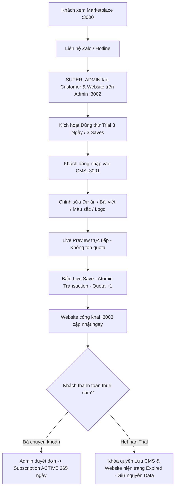
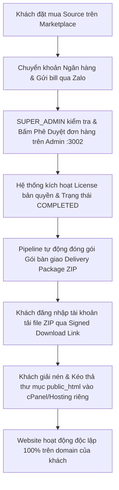

# 04. RENT VS BUY ARCHITECTURE — PLATFORMBDS V2

**Audit Date:** 2026-08-23  
**Auditor:** Principal Software Architect  
**Purpose:** Tách biệt 100% hai luồng kiến trúc và kinh doanh: Thuê Website (RENT) vs Mua Source Code (BUY)

---

## 1. Bảng So Sánh Kiến Trúc RENT vs BUY

| Tiêu chí | PRODUCT A: THUÊ WEBSITE (RENT) | PRODUCT B: MUA SOURCE (BUY) |
| :--- | :--- | :--- |
| **Mô hình kinh doanh** | Dịch vụ thuê phần mềm theo Năm (Yearly SaaS) | Mua bản quyền & Source Code trọn gói |
| **Quyền sở hữu** | Khách thuê quyền sử dụng trên hệ thống PlatformBDS | Khách sở hữu toàn bộ bộ mã nguồn và tệp tĩnh |
| **Nơi lưu trữ (Hosting)** | **Platform-Managed**: Máy chủ Cloud của PlatformBDS | **Customer-Hosted**: Hosting/VPS riêng của Khách hàng |
| **Hệ thống Quản trị (CMS)** | Có sẵn CMS trên nền tảng (`localhost:3001` / Subdomain) | Chạy độc lập theo gói xuất bản HTML tĩnh |
| **Cơ chế cập nhật** | Sửa trên CMS → Lưu Database → Website cập nhật tức thì | Chỉnh sửa trực tiếp file code hoặc cập nhật thủ công |
| **Chu kỳ thanh toán** | Hàng năm (365 ngày) | Thanh toán 1 lần duy nhất khi mua |
| **Hình thức bàn giao** | Tài khoản CMS + Link Website + Tên miền Subdomain/Custom | **Customer Delivery Package (File ZIP)** |

---

## 2. Chi Tiết Luồng Hoạt Động (Business Flow)

### 2.1 Luồng PRODUCT A — Thuê Website (RENT)



* **Quy định Trial & Quota**:
  - `TRIAL_DURATION_DAYS = 3` (3 ngày trải nghiệm miễn phí).
  - `TRIAL_SAVE_LIMIT = 3` (Tối đa 3 lần bấm Lưu vĩnh viễn vào Database).
  - Cảnh báo vàng trước 24h hết hạn.
  - Khi hết hạn: Dữ liệu **KHÔNG BỊ XÓA**, chỉ khóa quyền lưu CMS và chuyển trạng thái website sang `EXPIRED`.

---

### 2.2 Luồng PRODUCT B — Mua Source Code (BUY)



* **Bảo mật Tải Source Code (Download Security)**:
  - Đường dẫn tải **KHÔNG PUBLIC** (Không để lộ link trực tiếp dạng `/files/source.zip`).
  - Phải qua xác thực JWT + Kiểm tra `order.type === 'BUY_SOURCE'` + `order.status === 'COMPLETED'` + `order.userId === authenticatedUser.id`.
  - Mọi lượt tải đều được ghi nhận vào `AuditLog`.

---

## 3. Cấu Trúc Gói Bàn Giao (Customer Delivery Package)

Dành cho khách hàng LOW-TECH, cấu trúc file ZIP tải về được tối ưu đơn giản nhất:

```text
BDS-PREMIUM-WEBSITE-DELIVERY/
│
├── public_html/                          # Thư mục Web Tĩnh dùng cho cPanel / DirectAdmin
│   ├── index.html                        # Trang chủ đầy đủ nội dung & hiệu ứng
│   ├── about.html                        # Trang giới thiệu công ty
│   ├── contact.html                      # Trang liên hệ
│   ├── projects/                         # Danh sách & chi tiết các dự án
│   ├── blog/                             # Tin tức BĐS
│   ├── assets/                           # CSS, Fonts, Icons, JS bundle
│   └── images/                           # Toàn bộ hình ảnh mẫu chất lượng cao
│
├── HUONG_DAN_CAI_DAT_TIENG_VIET.pdf      # Hướng dẫn từng bước bằng hình ảnh: Upload cPanel trong 60 giây
├── LICENSE.txt                           # Giấy phép quyền tác giả & chứng nhận bản quyền
└── source_code_nextjs/ (Tùy chọn)        # Toàn bộ source code Next.js gốc nếu khách có đội ngũ kỹ thuật
```
