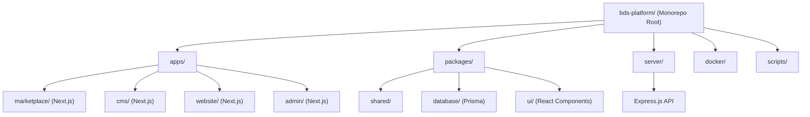

# 05 - Cấu Trúc Thư Mục Dự Án (Folder Structure)

> **Phiên bản:** 1.0  
> **Ngày tạo:** 05/07/2026  
> **Tác giả:** Principal Software Architect  
> **Dự án:** Real Estate Template Marketplace & SaaS Platform

---

## Mục Lục

1. [Tổng Quan Kiến Trúc](#1-tổng-quan-kiến-trúc)
2. [Cấu Trúc Root](#2-cấu-trúc-root)
3. [Apps - Marketplace](#3-apps---marketplace)
4. [Apps - CMS](#4-apps---cms)
5. [Apps - Website](#5-apps---website)
6. [Apps - Admin](#6-apps---admin)
7. [Packages - Shared](#7-packages---shared)
8. [Packages - Database](#8-packages---database)
9. [Packages - UI](#9-packages---ui)
10. [Server](#10-server)
11. [Docker](#11-docker)
12. [Scripts](#12-scripts)

---

## 1. Tổng Quan Kiến Trúc



Dự án sử dụng kiến trúc **Monorepo** được quản lý bởi **npm workspaces** (hoặc turborepo). Mọi ứng dụng, package dùng chung, và server API đều nằm trong một repository duy nhất.

---

## 2. Cấu Trúc Root

```
bds-platform/
│
├── .github/                          # GitHub Actions CI/CD workflows
│   └── workflows/
│       ├── ci.yml                    # Chạy lint, test khi push/PR
│       ├── deploy-staging.yml        # Deploy lên staging server
│       └── deploy-production.yml     # Deploy lên production server
│
├── .husky/                           # Git hooks (pre-commit, commit-msg)
│   ├── pre-commit                    # Chạy lint-staged trước khi commit
│   └── commit-msg                    # Validate conventional commit message
│
├── .vscode/                          # VS Code workspace settings
│   ├── settings.json                 # Editor settings chung cho team
│   ├── extensions.json               # Extensions khuyến nghị
│   └── launch.json                   # Debug configurations
│
├── apps/                             # Các ứng dụng frontend (Next.js)
│   ├── marketplace/                  # Website giới thiệu & bán template
│   ├── cms/                          # Hệ thống quản trị nội dung cho tenant
│   ├── website/                      # Website BĐS của tenant (multi-tenant)
│   └── admin/                        # Admin panel quản trị platform
│
├── packages/                         # Shared packages dùng chung
│   ├── shared/                       # Types, utils, constants, validators
│   ├── database/                     # Prisma schema, migrations, seed
│   └── ui/                           # Shared UI components (React)
│
├── server/                           # Express.js API backend
│
├── docker/                           # Docker configs, Nginx configs
│
├── scripts/                          # Scripts tiện ích: deploy, setup, backup
│
├── .env.example                      # File mẫu biến môi trường (KHÔNG chứa secrets)
├── .env.development                  # Biến môi trường cho local dev (git-ignored)
├── .env.staging                      # Biến môi trường cho staging (git-ignored)
├── .env.production                   # Biến môi trường cho production (git-ignored)
├── .eslintrc.js                      # ESLint config root (extends cho tất cả apps)
├── .eslintignore                     # Các thư mục bỏ qua khi lint
├── .gitignore                        # Danh sách file/thư mục không track bởi Git
├── .prettierrc                       # Prettier formatting config
├── .prettierignore                   # Các file bỏ qua khi format
├── docker-compose.yml                # Docker Compose cho toàn bộ hệ thống
├── docker-compose.dev.yml            # Docker Compose cho môi trường dev
├── docker-compose.prod.yml           # Docker Compose cho production (override)
├── package.json                      # Root package.json (workspaces config)
├── package-lock.json                 # Lock file đảm bảo consistent dependencies
├── tsconfig.json                     # TypeScript config gốc (base)
├── tsconfig.base.json                # TypeScript base config kế thừa bởi các app
├── turbo.json                        # Turborepo pipeline config (build, lint, dev)
├── LICENSE                           # Giấy phép sử dụng
└── README.md                         # Hướng dẫn tổng quan dự án
```

---

## 3. Apps - Marketplace

```
apps/marketplace/
│
├── public/                           # Static assets (phục vụ trực tiếp bởi Next.js)
│   ├── images/
│   │   ├── logo.svg                  # Logo platform
│   │   ├── logo-dark.svg             # Logo cho nền tối
│   │   ├── favicon.ico               # Favicon
│   │   ├── og-image.jpg              # Default Open Graph image
│   │   └── placeholder/
│   │       ├── template-thumb.jpg    # Ảnh placeholder cho template
│   │       └── no-image.jpg          # Ảnh khi không có hình
│   ├── fonts/                        # Custom fonts (self-hosted)
│   │   ├── PlayfairDisplay-*.woff2   # Font heading
│   │   └── Inter-*.woff2            # Font body
│   └── robots.txt                    # Robots.txt cho SEO
│
├── src/
│   ├── app/                          # Next.js App Router (pages)
│   │   ├── layout.tsx                # Root layout (html, body, providers)
│   │   ├── page.tsx                  # Trang chủ marketplace
│   │   ├── loading.tsx               # Loading UI skeleton cho trang chủ
│   │   ├── error.tsx                 # Error boundary trang chủ
│   │   ├── not-found.tsx             # Trang 404 custom
│   │   ├── globals.css               # Global styles + TailwindCSS imports
│   │   │
│   │   ├── (marketing)/              # Route group: các trang marketing
│   │   │   ├── layout.tsx            # Layout chung cho marketing pages
│   │   │   ├── gioi-thieu/
│   │   │   │   └── page.tsx          # Trang giới thiệu platform
│   │   │   ├── bang-gia/
│   │   │   │   └── page.tsx          # Trang bảng giá (pricing)
│   │   │   ├── lien-he/
│   │   │   │   └── page.tsx          # Trang liên hệ
│   │   │   └── huong-dan/
│   │   │       └── page.tsx          # Trang hướng dẫn sử dụng
│   │   │
│   │   ├── templates/                # Trang template
│   │   │   ├── page.tsx              # Danh sách templates
│   │   │   ├── loading.tsx           # Loading skeleton cho listing
│   │   │   └── [slug]/
│   │   │       ├── page.tsx          # Chi tiết template
│   │   │       ├── loading.tsx       # Loading skeleton chi tiết
│   │   │       └── demo/
│   │   │           └── page.tsx      # Trang xem demo template
│   │   │
│   │   ├── bao-gia/
│   │   │   └── page.tsx              # Form yêu cầu báo giá
│   │   │
│   │   ├── auth/                     # Trang xác thực
│   │   │   ├── dang-nhap/
│   │   │   │   └── page.tsx          # Trang đăng nhập
│   │   │   ├── dang-ky/
│   │   │   │   └── page.tsx          # Trang đăng ký
│   │   │   ├── quen-mat-khau/
│   │   │   │   └── page.tsx          # Trang quên mật khẩu
│   │   │   └── dat-lai-mat-khau/
│   │   │       └── page.tsx          # Trang đặt lại mật khẩu (có token)
│   │   │
│   │   └── api/                      # API Routes (nếu cần proxy)
│   │       └── revalidate/
│   │           └── route.ts          # On-demand ISR revalidation endpoint
│   │
│   ├── components/                   # React components cho marketplace
│   │   ├── layout/                   # Layout components
│   │   │   ├── Header.tsx            # Header/Navigation bar
│   │   │   ├── Footer.tsx            # Footer
│   │   │   ├── MobileNav.tsx         # Mobile navigation drawer
│   │   │   └── Breadcrumb.tsx        # Breadcrumb navigation
│   │   │
│   │   ├── home/                     # Components cho trang chủ
│   │   │   ├── HeroSection.tsx       # Banner hero chính
│   │   │   ├── FeaturedTemplates.tsx  # Carousel templates nổi bật
│   │   │   ├── PricingSection.tsx    # Bảng giá tóm tắt
│   │   │   ├── TestimonialSection.tsx # Đánh giá khách hàng
│   │   │   ├── FeatureSection.tsx    # Tính năng nổi bật
│   │   │   ├── CTASection.tsx        # Call-to-action section
│   │   │   └── StatsSection.tsx      # Thống kê (số template, khách hàng)
│   │   │
│   │   ├── templates/                # Components cho trang template
│   │   │   ├── TemplateCard.tsx      # Card hiển thị template
│   │   │   ├── TemplateGrid.tsx      # Grid layout danh sách
│   │   │   ├── TemplateFilter.tsx    # Bộ lọc sidebar
│   │   │   ├── TemplatePreview.tsx   # Preview ảnh template (lightbox)
│   │   │   ├── TemplateDetail.tsx    # Chi tiết template
│   │   │   ├── DemoViewer.tsx        # Iframe xem demo
│   │   │   └── PricingCard.tsx       # Card giá mua/thuê
│   │   │
│   │   ├── forms/                    # Form components
│   │   │   ├── QuotationForm.tsx     # Form yêu cầu báo giá
│   │   │   ├── ContactForm.tsx       # Form liên hệ
│   │   │   ├── LoginForm.tsx         # Form đăng nhập
│   │   │   ├── RegisterForm.tsx      # Form đăng ký
│   │   │   └── ForgotPasswordForm.tsx # Form quên mật khẩu
│   │   │
│   │   └── common/                   # Components dùng chung
│   │       ├── SEOHead.tsx           # SEO metadata component
│   │       ├── LoadingSpinner.tsx    # Loading indicator
│   │       ├── Pagination.tsx        # Phân trang
│   │       ├── EmptyState.tsx        # Trạng thái trống
│   │       └── Toast.tsx             # Toast notification
│   │
│   ├── hooks/                        # Custom React hooks
│   │   ├── useAuth.ts                # Hook quản lý authentication state
│   │   ├── useTemplates.ts           # Hook fetch templates (SWR/React Query)
│   │   ├── useDebounce.ts            # Debounce cho search input
│   │   ├── useMediaQuery.ts          # Responsive breakpoint detection
│   │   └── useIntersectionObserver.ts # Lazy loading / infinite scroll
│   │
│   ├── lib/                          # Thư viện, config, utilities
│   │   ├── api.ts                    # API client (axios instance + interceptors)
│   │   ├── auth.ts                   # Auth utilities (token storage, refresh logic)
│   │   ├── constants.ts              # Constants riêng cho marketplace
│   │   └── seo.ts                    # SEO metadata generators
│   │
│   ├── styles/                       # Custom styles
│   │   └── animations.css            # Custom CSS animations
│   │
│   └── types/                        # TypeScript types riêng cho marketplace
│       └── index.ts                  # Re-export types
│
├── next.config.js                    # Next.js configuration
├── tailwind.config.ts                # TailwindCSS configuration
├── postcss.config.js                 # PostCSS configuration
├── tsconfig.json                     # TypeScript config (extends root)
├── package.json                      # Dependencies riêng cho marketplace
└── .env.local                        # Biến môi trường local (git-ignored)
```

---

## 4. Apps - CMS

```
apps/cms/
│
├── public/
│   ├── images/
│   │   ├── logo-cms.svg              # Logo CMS
│   │   └── placeholder/
│   │       └── no-image.jpg          # Ảnh placeholder
│   └── tinymce/                      # TinyMCE editor assets (self-hosted)
│
├── src/
│   ├── app/
│   │   ├── layout.tsx                # Root layout với sidebar
│   │   ├── page.tsx                  # Redirect tới dashboard
│   │   ├── loading.tsx               # Global loading
│   │   │
│   │   ├── auth/                     # Auth pages (không có sidebar)
│   │   │   ├── layout.tsx            # Auth layout (centered)
│   │   │   └── dang-nhap/
│   │   │       └── page.tsx          # Trang đăng nhập CMS
│   │   │
│   │   └── (dashboard)/              # Dashboard route group (có sidebar)
│   │       ├── layout.tsx            # Dashboard layout với sidebar + header
│   │       │
│   │       ├── dashboard/
│   │       │   └── page.tsx          # Tổng quan (stats, recent activities)
│   │       │
│   │       ├── du-an/                # Quản lý dự án BĐS
│   │       │   ├── page.tsx          # Danh sách dự án (table + actions)
│   │       │   ├── tao-moi/
│   │       │   │   └── page.tsx      # Form tạo dự án mới
│   │       │   └── [id]/
│   │       │       ├── page.tsx      # Xem chi tiết dự án
│   │       │       └── chinh-sua/
│   │       │           └── page.tsx  # Form chỉnh sửa dự án
│   │       │
│   │       ├── bai-viet/             # Quản lý bài viết blog
│   │       │   ├── page.tsx          # Danh sách bài viết
│   │       │   ├── tao-moi/
│   │       │   │   └── page.tsx      # Tạo bài viết mới (WYSIWYG editor)
│   │       │   └── [id]/
│   │       │       └── chinh-sua/
│   │       │           └── page.tsx  # Chỉnh sửa bài viết
│   │       │
│   │       ├── danh-muc/             # Quản lý danh mục
│   │       │   └── page.tsx          # CRUD danh mục (inline editing)
│   │       │
│   │       ├── banner/               # Quản lý banner/slider
│   │       │   ├── page.tsx          # Danh sách banner
│   │       │   └── [id]/
│   │       │       └── page.tsx      # Chỉnh sửa banner
│   │       │
│   │       ├── menu/                 # Quản lý menu navigation
│   │       │   └── page.tsx          # Drag-drop sắp xếp menu
│   │       │
│   │       ├── thong-tin-cong-ty/    # Thông tin công ty
│   │       │   └── page.tsx          # Form cập nhật info
│   │       │
│   │       ├── cau-hinh-seo/         # Cấu hình SEO
│   │       │   └── page.tsx          # Form cấu hình SEO
│   │       │
│   │       ├── thu-vien-anh/         # Quản lý media
│   │       │   └── page.tsx          # Media library (grid view + upload)
│   │       │
│   │       └── lien-he/              # Xem form liên hệ đã nhận
│   │           └── page.tsx          # Danh sách contact submissions
│   │
│   ├── components/
│   │   ├── layout/
│   │   │   ├── Sidebar.tsx           # Sidebar navigation menu
│   │   │   ├── DashboardHeader.tsx   # Header với user info, notifications
│   │   │   ├── SidebarItem.tsx       # Menu item trong sidebar
│   │   │   └── BreadcrumbNav.tsx     # Breadcrumb trong dashboard
│   │   │
│   │   ├── dashboard/
│   │   │   ├── StatCard.tsx          # Card thống kê (số dự án, bài viết...)
│   │   │   ├── RecentContactsList.tsx # Danh sách liên hệ gần đây
│   │   │   └── WebsiteStatus.tsx     # Trạng thái website
│   │   │
│   │   ├── projects/
│   │   │   ├── ProjectForm.tsx       # Form tạo/sửa dự án (multi-step)
│   │   │   ├── ProjectTable.tsx      # Bảng danh sách dự án
│   │   │   ├── ProjectImageUpload.tsx # Upload nhiều ảnh dự án
│   │   │   ├── LocationPicker.tsx    # Chọn vị trí (ward/district/city)
│   │   │   ├── AmenitySelector.tsx   # Chọn tiện ích
│   │   │   └── FloorPlanUpload.tsx   # Upload mặt bằng
│   │   │
│   │   ├── posts/
│   │   │   ├── PostForm.tsx          # Form tạo/sửa bài viết
│   │   │   ├── PostTable.tsx         # Bảng danh sách bài viết
│   │   │   └── RichTextEditor.tsx    # WYSIWYG editor (TinyMCE wrapper)
│   │   │
│   │   ├── banners/
│   │   │   ├── BannerForm.tsx        # Form tạo/sửa banner
│   │   │   └── BannerList.tsx        # Danh sách banner sortable
│   │   │
│   │   ├── menus/
│   │   │   ├── MenuEditor.tsx        # Tree editor cho menu
│   │   │   └── MenuItemForm.tsx      # Form thêm/sửa menu item
│   │   │
│   │   ├── media/
│   │   │   ├── MediaLibrary.tsx      # Grid view media library
│   │   │   ├── MediaUploader.tsx     # Dropzone upload component
│   │   │   ├── MediaPickerModal.tsx  # Modal chọn ảnh từ thư viện
│   │   │   └── ImageCropper.tsx      # Crop ảnh trước upload
│   │   │
│   │   └── common/
│   │       ├── DataTable.tsx         # Bảng dữ liệu tái sử dụng
│   │       ├── ConfirmDialog.tsx     # Dialog xác nhận xóa
│   │       ├── FormField.tsx         # Wrapper cho form field
│   │       ├── StatusBadge.tsx       # Badge hiển thị trạng thái
│   │       ├── SearchInput.tsx       # Input tìm kiếm có debounce
│   │       └── SEOPreview.tsx        # Preview hiển thị SEO trên Google
│   │
│   ├── hooks/
│   │   ├── useAuth.ts                # Authentication hook cho CMS
│   │   ├── useTenant.ts              # Hook lấy tenant context
│   │   ├── useProjects.ts            # Hook CRUD projects
│   │   ├── usePosts.ts               # Hook CRUD posts
│   │   ├── useMedia.ts               # Hook upload/quản lý media
│   │   ├── useCategories.ts          # Hook CRUD categories
│   │   └── useDashboard.ts           # Hook lấy dashboard stats
│   │
│   ├── lib/
│   │   ├── api.ts                    # API client configured cho CMS
│   │   ├── auth.ts                   # Auth utilities
│   │   ├── upload.ts                 # Upload helper functions
│   │   └── constants.ts              # CMS-specific constants
│   │
│   └── types/
│       └── index.ts                  # CMS-specific types
│
├── next.config.js
├── tailwind.config.ts
├── tsconfig.json
└── package.json
```

---

## 5. Apps - Website

```
apps/website/
│
├── public/
│   ├── images/
│   │   ├── placeholder/
│   │   │   ├── project-thumb.jpg     # Placeholder ảnh dự án
│   │   │   ├── blog-thumb.jpg        # Placeholder ảnh bài viết
│   │   │   └── no-image.jpg          # Ảnh mặc định
│   │   └── icons/
│   │       ├── amenity-pool.svg      # Icon hồ bơi
│   │       ├── amenity-gym.svg       # Icon phòng gym
│   │       ├── amenity-park.svg      # Icon công viên
│   │       ├── amenity-security.svg  # Icon an ninh
│   │       └── amenity-parking.svg   # Icon bãi đỗ xe
│   └── robots.txt
│
├── src/
│   ├── app/
│   │   ├── layout.tsx                # Root layout (resolve tenant, load theme)
│   │   ├── page.tsx                  # Trang chủ website BĐS
│   │   ├── loading.tsx               # Loading skeleton
│   │   │
│   │   ├── gioi-thieu/
│   │   │   └── page.tsx              # Trang giới thiệu công ty
│   │   │
│   │   ├── du-an/                    # Trang dự án
│   │   │   ├── page.tsx              # Danh sách dự án (grid + filter)
│   │   │   └── [slug]/
│   │   │       └── page.tsx          # Chi tiết dự án (gallery, info, form)
│   │   │
│   │   ├── tin-tuc/                  # Trang blog/tin tức
│   │   │   ├── page.tsx              # Danh sách bài viết
│   │   │   └── [slug]/
│   │   │       └── page.tsx          # Chi tiết bài viết
│   │   │
│   │   ├── lien-he/
│   │   │   └── page.tsx              # Trang liên hệ (form + bản đồ)
│   │   │
│   │   ├── landing/                  # Landing page cho dự án cụ thể
│   │   │   └── [slug]/
│   │   │       └── page.tsx          # Landing page dự án
│   │   │
│   │   └── sitemap.ts                # Dynamic sitemap generation
│   │
│   ├── components/
│   │   ├── layout/
│   │   │   ├── Header.tsx            # Header responsive (load từ menu config)
│   │   │   ├── Footer.tsx            # Footer (load từ company info)
│   │   │   ├── MobileMenu.tsx        # Mobile hamburger menu
│   │   │   ├── TopBar.tsx            # Top bar (hotline, email)
│   │   │   └── FloatingButtons.tsx   # Nút Zalo/điện thoại nổi
│   │   │
│   │   ├── home/
│   │   │   ├── HeroBanner.tsx        # Banner slider trang chủ
│   │   │   ├── FeaturedProjects.tsx   # Dự án nổi bật
│   │   │   ├── AboutPreview.tsx      # Giới thiệu ngắn
│   │   │   ├── LatestNews.tsx        # Tin tức mới nhất
│   │   │   ├── WhyChooseUs.tsx       # Tại sao chọn chúng tôi
│   │   │   └── CTASection.tsx        # Call to action
│   │   │
│   │   ├── projects/
│   │   │   ├── ProjectCard.tsx       # Card dự án
│   │   │   ├── ProjectGrid.tsx       # Grid layout dự án
│   │   │   ├── ProjectFilter.tsx     # Bộ lọc (loại, giá, diện tích, khu vực)
│   │   │   ├── ProjectGallery.tsx    # Gallery ảnh dự án (lightbox)
│   │   │   ├── ProjectInfo.tsx       # Thông tin chi tiết dự án
│   │   │   ├── ProjectAmenities.tsx  # Tiện ích dự án (icons grid)
│   │   │   ├── ProjectFloorPlans.tsx # Mặt bằng dự án
│   │   │   ├── ProjectLocation.tsx   # Bản đồ vị trí (Google Maps)
│   │   │   ├── ProjectDocuments.tsx  # Tài liệu pháp lý download
│   │   │   ├── ProjectContactForm.tsx # Form liên hệ trong trang dự án
│   │   │   └── RelatedProjects.tsx   # Dự án liên quan
│   │   │
│   │   ├── blog/
│   │   │   ├── PostCard.tsx          # Card bài viết
│   │   │   ├── PostGrid.tsx          # Grid layout bài viết
│   │   │   ├── PostContent.tsx       # Nội dung bài viết (styled HTML)
│   │   │   ├── PostSidebar.tsx       # Sidebar (categories, recent posts)
│   │   │   └── ShareButtons.tsx      # Nút chia sẻ mạng xã hội
│   │   │
│   │   ├── contact/
│   │   │   ├── ContactForm.tsx       # Form liên hệ
│   │   │   ├── ContactInfo.tsx       # Thông tin liên hệ (địa chỉ, SĐT)
│   │   │   └── GoogleMap.tsx         # Google Maps embed
│   │   │
│   │   └── common/
│   │       ├── SectionHeading.tsx    # Heading cho mỗi section
│   │       ├── Pagination.tsx        # Phân trang
│   │       ├── BackToTop.tsx         # Nút cuộn lên đầu trang
│   │       ├── LoadingSkeleton.tsx   # Skeleton loading animations
│   │       └── SEOHead.tsx           # Dynamic SEO metadata
│   │
│   ├── themes/                       # Cấu hình theme cho từng template
│   │   ├── luxury-gold/
│   │   │   ├── theme.config.ts       # CSS variables, colors, fonts
│   │   │   ├── components.config.ts  # Layout config cho components
│   │   │   └── globals.css           # Theme-specific CSS overrides
│   │   │
│   │   ├── modern-blue/
│   │   │   ├── theme.config.ts
│   │   │   ├── components.config.ts
│   │   │   └── globals.css
│   │   │
│   │   ├── minimal-white/
│   │   │   ├── theme.config.ts
│   │   │   ├── components.config.ts
│   │   │   └── globals.css
│   │   │
│   │   └── index.ts                  # Theme registry & resolver
│   │
│   ├── hooks/
│   │   ├── useTenant.ts              # Hook resolve tenant từ subdomain
│   │   ├── useTheme.ts               # Hook load theme config
│   │   ├── useProjects.ts            # Hook fetch projects
│   │   ├── usePosts.ts               # Hook fetch posts
│   │   └── useCompanyInfo.ts         # Hook fetch company info
│   │
│   ├── lib/
│   │   ├── api.ts                    # API client cho website
│   │   ├── tenant-resolver.ts        # Logic phân giải tenant từ domain/subdomain
│   │   ├── theme-loader.ts           # Load theme config dựa trên tenant
│   │   ├── seo.ts                    # SEO utilities
│   │   └── constants.ts              # Constants
│   │
│   └── types/
│       └── index.ts
│
├── next.config.js                    # Config với subdomain rewrites
├── middleware.ts                     # Middleware xử lý subdomain routing
├── tailwind.config.ts
├── tsconfig.json
└── package.json
```

---

## 6. Apps - Admin

```
apps/admin/
│
├── public/
│   └── images/
│       └── logo-admin.svg            # Logo admin panel
│
├── src/
│   ├── app/
│   │   ├── layout.tsx                # Root layout admin
│   │   │
│   │   ├── auth/
│   │   │   └── dang-nhap/
│   │   │       └── page.tsx          # Trang đăng nhập admin
│   │   │
│   │   └── (dashboard)/
│   │       ├── layout.tsx            # Admin dashboard layout
│   │       │
│   │       ├── dashboard/
│   │       │   └── page.tsx          # Admin dashboard (stats, charts)
│   │       │
│   │       ├── don-hang/             # Quản lý đơn hàng
│   │       │   ├── page.tsx          # Danh sách đơn hàng
│   │       │   └── [id]/
│   │       │       └── page.tsx      # Chi tiết + duyệt/từ chối đơn
│   │       │
│   │       ├── nguoi-dung/           # Quản lý người dùng
│   │       │   ├── page.tsx          # Danh sách người dùng
│   │       │   └── [id]/
│   │       │       └── page.tsx      # Chi tiết người dùng
│   │       │
│   │       ├── tenant/               # Quản lý tenant
│   │       │   ├── page.tsx          # Danh sách tenant
│   │       │   └── [id]/
│   │       │       └── page.tsx      # Chi tiết + quản lý tenant
│   │       │
│   │       ├── templates/            # Quản lý templates
│   │       │   ├── page.tsx          # Danh sách templates
│   │       │   ├── tao-moi/
│   │       │   │   └── page.tsx      # Tạo template mới
│   │       │   └── [id]/
│   │       │       └── chinh-sua/
│   │       │           └── page.tsx  # Chỉnh sửa template
│   │       │
│   │       └── cai-dat/              # Cài đặt hệ thống
│   │           └── page.tsx          # Cấu hình platform
│   │
│   ├── components/
│   │   ├── layout/
│   │   │   ├── AdminSidebar.tsx      # Sidebar admin
│   │   │   └── AdminHeader.tsx       # Header admin
│   │   │
│   │   ├── dashboard/
│   │   │   ├── RevenueChart.tsx      # Biểu đồ doanh thu
│   │   │   ├── OrdersChart.tsx       # Biểu đồ đơn hàng
│   │   │   ├── StatCards.tsx         # Cards thống kê
│   │   │   └── RecentOrdersList.tsx  # Đơn hàng gần đây
│   │   │
│   │   ├── orders/
│   │   │   ├── OrderTable.tsx        # Bảng đơn hàng
│   │   │   ├── OrderDetail.tsx       # Chi tiết đơn hàng
│   │   │   ├── ApproveOrderModal.tsx # Modal duyệt đơn
│   │   │   └── RejectOrderModal.tsx  # Modal từ chối đơn
│   │   │
│   │   ├── users/
│   │   │   └── UserTable.tsx         # Bảng người dùng
│   │   │
│   │   ├── tenants/
│   │   │   ├── TenantTable.tsx       # Bảng tenant
│   │   │   └── TenantDetail.tsx      # Chi tiết tenant
│   │   │
│   │   └── templates/
│   │       ├── TemplateForm.tsx      # Form tạo/sửa template
│   │       └── TemplateTable.tsx     # Bảng templates
│   │
│   ├── hooks/
│   │   ├── useAuth.ts               # Admin auth hook
│   │   ├── useOrders.ts             # Hook quản lý đơn hàng
│   │   ├── useUsers.ts              # Hook quản lý users
│   │   ├── useTenants.ts            # Hook quản lý tenants
│   │   └── useAdminDashboard.ts     # Hook dashboard stats
│   │
│   ├── lib/
│   │   ├── api.ts                   # API client cho admin
│   │   └── auth.ts                  # Admin auth utilities
│   │
│   └── types/
│       └── index.ts
│
├── next.config.js
├── tailwind.config.ts
├── tsconfig.json
└── package.json
```

---

## 7. Packages - Shared

```
packages/shared/
│
├── src/
│   ├── types/                        # TypeScript type definitions dùng chung
│   │   ├── auth.types.ts             # User, Token, Login/Register types
│   │   ├── template.types.ts         # Template, ThemeConfig types
│   │   ├── project.types.ts          # Project, ProjectType, ProjectStatus
│   │   ├── post.types.ts             # Post, Category, Tag types
│   │   ├── tenant.types.ts           # Tenant, TenantConfig types
│   │   ├── order.types.ts            # Order, OrderStatus types
│   │   ├── media.types.ts            # Media types
│   │   ├── banner.types.ts           # Banner types
│   │   ├── menu.types.ts             # MenuItem types
│   │   ├── company.types.ts          # CompanyInfo types
│   │   ├── seo.types.ts              # SeoConfig types
│   │   ├── contact.types.ts          # ContactSubmission types
│   │   ├── demo.types.ts             # DemoSession types
│   │   ├── api.types.ts              # API response wrapper types
│   │   └── index.ts                  # Re-export tất cả types
│   │
│   ├── utils/                        # Utility functions dùng chung
│   │   ├── format.ts                 # Format tiền VNĐ, ngày tháng, diện tích
│   │   ├── slug.ts                   # Generate slug từ tiếng Việt
│   │   ├── validation.ts             # Validation helpers (email, phone, URL)
│   │   ├── date.ts                   # Date manipulation utilities
│   │   ├── string.ts                 # String helpers (truncate, capitalize)
│   │   ├── number.ts                 # Number helpers (parsePrice, formatArea)
│   │   ├── url.ts                    # URL manipulation helpers
│   │   └── index.ts                  # Re-export utilities
│   │
│   ├── constants/                    # Constants dùng chung
│   │   ├── project.constants.ts      # PROJECT_TYPES, PROJECT_STATUSES
│   │   ├── order.constants.ts        # ORDER_STATUSES, ORDER_TYPES
│   │   ├── role.constants.ts         # USER_ROLES
│   │   ├── vietnam.constants.ts      # Danh sách tỉnh/thành, quận/huyện VN
│   │   ├── seo.constants.ts          # SEO defaults, meta tag limits
│   │   ├── media.constants.ts        # ALLOWED_TYPES, MAX_FILE_SIZE
│   │   └── index.ts                  # Re-export constants
│   │
│   ├── validators/                   # Validation schemas (Zod)
│   │   ├── auth.validator.ts         # Login, register, reset password schemas
│   │   ├── project.validator.ts      # Create/update project schemas
│   │   ├── post.validator.ts         # Create/update post schemas
│   │   ├── banner.validator.ts       # Banner schemas
│   │   ├── menu.validator.ts         # Menu schemas
│   │   ├── company.validator.ts      # Company info schemas
│   │   ├── contact.validator.ts      # Contact form schemas
│   │   ├── quotation.validator.ts    # Quotation schemas
│   │   ├── template.validator.ts     # Template schemas
│   │   └── index.ts                  # Re-export validators
│   │
│   └── index.ts                      # Package entry point
│
├── tsconfig.json                     # TypeScript config
└── package.json                      # Package config
```

---

## 8. Packages - Database

```
packages/database/
│
├── prisma/
│   ├── schema.prisma                 # Prisma schema chính (tất cả models)
│   │
│   ├── migrations/                   # Database migrations (auto-generated)
│   │   ├── 20260701000000_init/
│   │   │   └── migration.sql         # Migration SQL khởi tạo
│   │   └── migration_lock.toml       # Lock file migration
│   │
│   └── seed/
│       ├── index.ts                  # Entry point cho seed script
│       ├── seed-admin.ts             # Seed admin user
│       ├── seed-templates.ts         # Seed 3 templates
│       ├── seed-tenants.ts           # Seed sample tenants
│       ├── seed-projects.ts          # Seed sample BĐS projects
│       ├── seed-posts.ts             # Seed sample blog posts
│       ├── seed-company-info.ts      # Seed company info
│       ├── seed-banners.ts           # Seed sample banners
│       ├── seed-menus.ts             # Seed default menus
│       └── data/                     # JSON data files cho seeding
│           ├── templates.json        # Template data
│           ├── projects.json         # Project data
│           └── vietnam-locations.json # Dữ liệu địa phận VN
│
├── src/
│   ├── client.ts                     # Prisma client instance (singleton)
│   ├── types.ts                      # Prisma-generated types re-export
│   └── index.ts                      # Package entry point
│
├── tsconfig.json
└── package.json
```

---

## 9. Packages - UI

```
packages/ui/
│
├── src/
│   ├── components/                   # Shared UI components (headless/styled)
│   │   ├── Button.tsx                # Button component (variants: primary, secondary, outline, ghost)
│   │   ├── Input.tsx                 # Text input component
│   │   ├── Select.tsx                # Select/dropdown component
│   │   ├── Textarea.tsx              # Textarea component
│   │   ├── Checkbox.tsx              # Checkbox component
│   │   ├── Radio.tsx                 # Radio button component
│   │   ├── Switch.tsx                # Toggle switch component
│   │   ├── Modal.tsx                 # Modal/dialog component
│   │   ├── Drawer.tsx                # Side drawer component
│   │   ├── Dropdown.tsx              # Dropdown menu component
│   │   ├── Tabs.tsx                  # Tab navigation component
│   │   ├── Accordion.tsx             # Accordion/collapse component
│   │   ├── Badge.tsx                 # Status badge component
│   │   ├── Alert.tsx                 # Alert/notification component
│   │   ├── Toast.tsx                 # Toast notification component
│   │   ├── Avatar.tsx                # User avatar component
│   │   ├── Card.tsx                  # Card container component
│   │   ├── Table.tsx                 # Data table component
│   │   ├── Pagination.tsx            # Pagination component
│   │   ├── Spinner.tsx               # Loading spinner
│   │   ├── Skeleton.tsx              # Skeleton loading placeholder
│   │   ├── Breadcrumb.tsx            # Breadcrumb navigation
│   │   ├── EmptyState.tsx            # Empty state illustration
│   │   ├── FileUpload.tsx            # File upload dropzone
│   │   ├── ImagePreview.tsx          # Image preview with lightbox
│   │   └── RichTextEditor.tsx        # WYSIWYG editor wrapper
│   │
│   └── index.ts                      # Re-export tất cả components
│
├── tsconfig.json
└── package.json
```

---

## 10. Server

```
server/
│
├── src/
│   ├── app.ts                        # Express app setup (middleware, routes, error handling)
│   ├── server.ts                     # HTTP server entry point (listen port)
│   │
│   ├── config/                       # Cấu hình server
│   │   ├── index.ts                  # Config loader (merge env vars)
│   │   ├── database.ts               # Database connection config
│   │   ├── cloudinary.ts             # Cloudinary SDK config
│   │   ├── email.ts                  # Nodemailer SMTP config
│   │   ├── cors.ts                   # CORS whitelist config
│   │   └── rate-limit.ts             # Rate limiting config per route group
│   │
│   ├── routes/                       # Express route definitions
│   │   ├── index.ts                  # Route aggregator (/api/*)
│   │   ├── auth.routes.ts            # /api/auth/* routes
│   │   ├── template.routes.ts        # /api/templates/* routes
│   │   ├── quotation.routes.ts       # /api/quotations routes
│   │   ├── contact.routes.ts         # /api/contact routes
│   │   ├── cms/                      # CMS route group
│   │   │   ├── index.ts              # CMS route aggregator
│   │   │   ├── dashboard.routes.ts   # /api/cms/dashboard/*
│   │   │   ├── project.routes.ts     # /api/cms/projects/*
│   │   │   ├── post.routes.ts        # /api/cms/posts/*
│   │   │   ├── category.routes.ts    # /api/cms/categories/*
│   │   │   ├── banner.routes.ts      # /api/cms/banners/*
│   │   │   ├── menu.routes.ts        # /api/cms/menus/*
│   │   │   ├── company.routes.ts     # /api/cms/company-info
│   │   │   ├── seo.routes.ts         # /api/cms/seo-config
│   │   │   ├── media.routes.ts       # /api/cms/media/*
│   │   │   └── contact-submission.routes.ts  # /api/cms/contact-submissions/*
│   │   ├── demo.routes.ts            # /api/demo/* routes
│   │   ├── website.routes.ts         # /api/website/:tenantSlug/* routes
│   │   └── admin/                    # Admin route group
│   │       ├── index.ts              # Admin route aggregator
│   │       ├── dashboard.routes.ts   # /api/admin/dashboard/*
│   │       ├── user.routes.ts        # /api/admin/users/*
│   │       ├── tenant.routes.ts      # /api/admin/tenants/*
│   │       ├── order.routes.ts       # /api/admin/orders/*
│   │       └── template.routes.ts    # /api/admin/templates/*
│   │
│   ├── controllers/                  # Request handlers (thin layer)
│   │   ├── auth.controller.ts        # Auth request handling
│   │   ├── template.controller.ts    # Template request handling
│   │   ├── quotation.controller.ts   # Quotation request handling
│   │   ├── contact.controller.ts     # Contact form handling
│   │   ├── cms/
│   │   │   ├── dashboard.controller.ts
│   │   │   ├── project.controller.ts
│   │   │   ├── post.controller.ts
│   │   │   ├── category.controller.ts
│   │   │   ├── banner.controller.ts
│   │   │   ├── menu.controller.ts
│   │   │   ├── company.controller.ts
│   │   │   ├── seo.controller.ts
│   │   │   ├── media.controller.ts
│   │   │   └── contact-submission.controller.ts
│   │   ├── demo.controller.ts
│   │   ├── website.controller.ts
│   │   └── admin/
│   │       ├── dashboard.controller.ts
│   │       ├── user.controller.ts
│   │       ├── tenant.controller.ts
│   │       ├── order.controller.ts
│   │       └── template.controller.ts
│   │
│   ├── services/                     # Business logic layer
│   │   ├── auth.service.ts           # Auth logic (hash, JWT, refresh rotation)
│   │   ├── template.service.ts       # Template CRUD logic
│   │   ├── quotation.service.ts      # Quotation/order creation logic
│   │   ├── contact.service.ts        # Contact form storage + notification
│   │   ├── project.service.ts        # Project CRUD với tenant scope
│   │   ├── post.service.ts           # Post CRUD với tenant scope
│   │   ├── category.service.ts       # Category CRUD
│   │   ├── banner.service.ts         # Banner CRUD
│   │   ├── menu.service.ts           # Menu CRUD + reorder
│   │   ├── company.service.ts        # Company info upsert
│   │   ├── seo.service.ts            # SEO config upsert
│   │   ├── media.service.ts          # Media upload/delete (Cloudinary)
│   │   ├── contact-submission.service.ts  # Contact submission management
│   │   ├── demo.service.ts           # Demo session management
│   │   ├── website.service.ts        # Public website data fetching
│   │   ├── tenant.service.ts         # Tenant management
│   │   ├── user.service.ts           # User management
│   │   ├── order.service.ts          # Order management (approve/reject)
│   │   ├── email.service.ts          # Email sending (Nodemailer)
│   │   └── dashboard.service.ts      # Stats aggregation
│   │
│   ├── middleware/                    # Express middleware
│   │   ├── auth.middleware.ts         # JWT verification + user injection
│   │   ├── role.middleware.ts         # Role-based access control (RBAC)
│   │   ├── tenant.middleware.ts       # Tenant context resolution
│   │   ├── validate.middleware.ts     # Request validation (Zod schema)
│   │   ├── rate-limit.middleware.ts   # Rate limiting per route
│   │   ├── upload.middleware.ts       # Multer file upload config
│   │   ├── cors.middleware.ts         # CORS configuration
│   │   ├── error.middleware.ts        # Global error handler
│   │   └── logger.middleware.ts       # Request/response logging
│   │
│   ├── validators/                   # Zod validation schemas (server-side)
│   │   ├── auth.validator.ts
│   │   ├── project.validator.ts
│   │   ├── post.validator.ts
│   │   ├── template.validator.ts
│   │   ├── quotation.validator.ts
│   │   ├── banner.validator.ts
│   │   ├── menu.validator.ts
│   │   ├── company.validator.ts
│   │   ├── media.validator.ts
│   │   └── common.validator.ts       # Shared validators (pagination, id)
│   │
│   ├── utils/                        # Server utility functions
│   │   ├── response.ts               # Standardized API response helpers
│   │   ├── errors.ts                 # Custom error classes (AppError, NotFoundError...)
│   │   ├── jwt.ts                    # JWT sign/verify helpers
│   │   ├── hash.ts                   # bcrypt password hashing
│   │   ├── slug.ts                   # Slug generation
│   │   ├── pagination.ts             # Pagination helper (parse query, build meta)
│   │   ├── email-templates.ts        # HTML email templates
│   │   ├── cloudinary.ts             # Cloudinary upload/delete helpers
│   │   └── logger.ts                 # Winston/Pino logger setup
│   │
│   └── types/                        # Server-specific types
│       ├── express.d.ts              # Extended Express Request (user, tenant)
│       └── index.ts
│
├── tests/                            # API tests
│   ├── setup.ts                      # Test setup (test DB, fixtures)
│   ├── auth.test.ts                  # Auth endpoint tests
│   ├── project.test.ts               # Project CRUD tests
│   └── helpers/
│       ├── factory.ts                # Test data factories
│       └── auth.helper.ts            # Auth helper cho tests
│
├── tsconfig.json
├── package.json
├── jest.config.ts                    # Jest test configuration
├── nodemon.json                      # Nodemon config cho dev
└── .env.example                      # Biến môi trường mẫu cho server
```

---

## 11. Docker

```
docker/
│
├── nginx/
│   ├── nginx.conf                    # Main Nginx config
│   ├── conf.d/
│   │   ├── default.conf              # Default server block
│   │   ├── marketplace.conf          # Config cho www.myplatform.com
│   │   ├── cms.conf                  # Config cho cms.myplatform.com
│   │   ├── admin.conf                # Config cho admin.myplatform.com
│   │   ├── api.conf                  # Config cho api.myplatform.com
│   │   └── wildcard-tenant.conf      # Config cho *.myplatform.com (tenant)
│   ├── ssl/                          # SSL certificates (git-ignored, mounted)
│   │   ├── fullchain.pem
│   │   └── privkey.pem
│   └── snippets/
│       ├── ssl-params.conf           # SSL security params
│       ├── proxy-params.conf         # Proxy headers config
│       └── gzip.conf                 # Gzip compression config
│
├── Dockerfile.server                 # Dockerfile cho Express API server
├── Dockerfile.marketplace            # Dockerfile cho Next.js marketplace
├── Dockerfile.cms                    # Dockerfile cho Next.js CMS
├── Dockerfile.website                # Dockerfile cho Next.js website
├── Dockerfile.admin                  # Dockerfile cho Next.js admin
└── .dockerignore                     # Files bỏ qua khi build Docker image
```

---

## 12. Scripts

```
scripts/
│
├── setup/
│   ├── init.sh                       # Script khởi tạo dự án lần đầu
│   ├── install-deps.sh               # Install tất cả dependencies
│   └── setup-env.sh                  # Tạo .env files từ .env.example
│
├── deploy/
│   ├── deploy.sh                     # Script deploy production
│   ├── deploy-staging.sh             # Script deploy staging
│   ├── rollback.sh                   # Rollback về phiên bản trước
│   └── health-check.sh              # Kiểm tra health sau deploy
│
├── db/
│   ├── backup.sh                     # Backup PostgreSQL database
│   ├── restore.sh                    # Restore database từ backup
│   ├── migrate.sh                    # Chạy database migration
│   └── seed.sh                       # Chạy database seed
│
├── ssl/
│   ├── generate-ssl.sh               # Generate SSL certificate (Let's Encrypt)
│   └── renew-ssl.sh                  # Renew SSL certificate
│
└── utils/
    ├── clean.sh                      # Dọn dẹp node_modules, build artifacts
    ├── generate-types.sh             # Generate Prisma types
    └── create-tenant.sh              # Script tạo tenant mới (CLI)
```

---

## Tổng Kết Cấu Trúc

| Thành phần       | Công nghệ     | Mục đích                               |
|------------------|---------------|---------------------------------------|
| apps/marketplace | Next.js 14    | Website giới thiệu & bán template     |
| apps/cms         | Next.js 14    | Quản trị nội dung cho tenant          |
| apps/website     | Next.js 14    | Website BĐS multi-tenant             |
| apps/admin       | Next.js 14    | Admin panel quản trị platform         |
| packages/shared  | TypeScript    | Types, utils, constants dùng chung    |
| packages/database| Prisma        | Schema, migrations, seed data         |
| packages/ui      | React         | UI components tái sử dụng            |
| server/          | Express.js    | REST API backend                      |
| docker/          | Docker, Nginx | Containerization & reverse proxy      |
| scripts/         | Bash          | Automation scripts                    |

> **Quy tắc đặt tên:**
> - Files: `kebab-case.ts` (ví dụ: `auth.service.ts`)
> - Components: `PascalCase.tsx` (ví dụ: `ProjectCard.tsx`)
> - Hooks: `camelCase.ts` bắt đầu bằng `use` (ví dụ: `useProjects.ts`)
> - Constants: `UPPER_SNAKE_CASE` (ví dụ: `PROJECT_TYPES`)
> - URL paths (Vietnamese): `kebab-case` không dấu (ví dụ: `/du-an`, `/bai-viet`)
