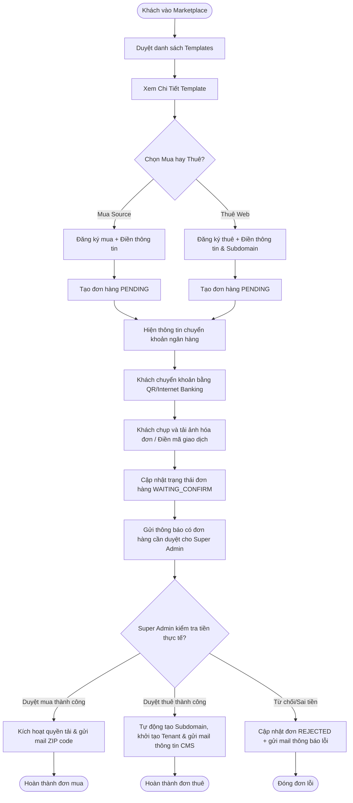
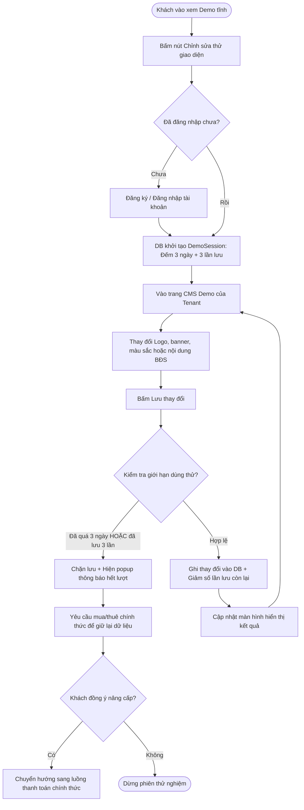
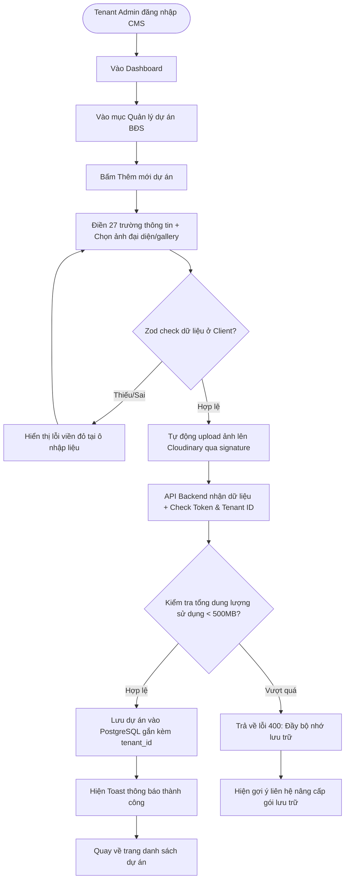
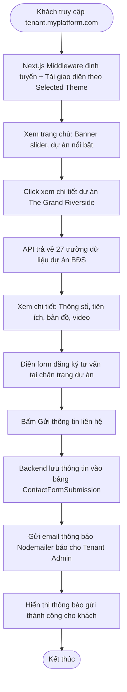

# 08. User Flows

> Tài liệu này mô tả chi tiết luồng trải nghiệm người dùng (User Flows) thông qua các sơ đồ Mermaid và diễn giải bước cụ thể cho các quy trình nghiệp vụ cốt lõi của nền tảng Real Estate Template Marketplace & SaaS Platform.

---

## 1. Luồng mua hoặc thuê giao diện thủ công (Purchase/Rent Flow)

Luồng mô tả hành trình từ khi khách hàng chọn mua hoặc thuê trên Marketplace, chuyển khoản, tải bill và đợi duyệt kích hoạt.

---

## 2. Luồng trải nghiệm và giới hạn dùng thử (Demo System Flow)

Luồng mô tả quá trình đăng ký dùng thử, chỉnh sửa giao diện và cơ chế tự động chặn khi hết hạn 3 ngày hoặc 3 lần lưu.

---

## 3. Luồng Tenant Admin quản trị nội dung CMS (CMS CRUD Flow)

Luồng mô tả hành động thêm mới một dự án bất động sản của Tenant Admin, bao gồm bước tải ảnh lên Cloudinary và kiểm soát quota dung lượng.

---

## 4. Luồng khách truy cập Website Tenant (End-User Website Flow)

Luồng mô tả hành trình khách hàng xem dự án của một môi giới (ví dụ: `hoanggialand.myplatform.com`) và gửi liên hệ báo giá.

