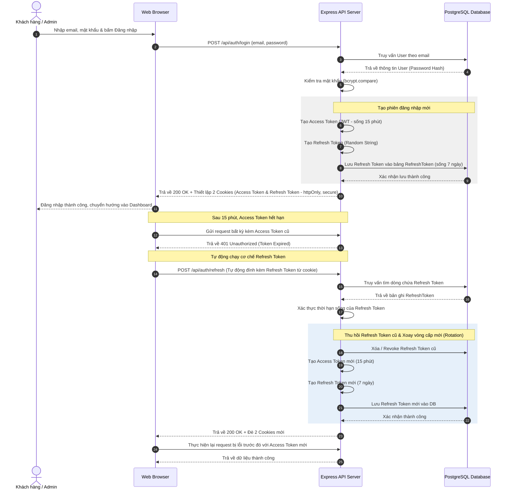
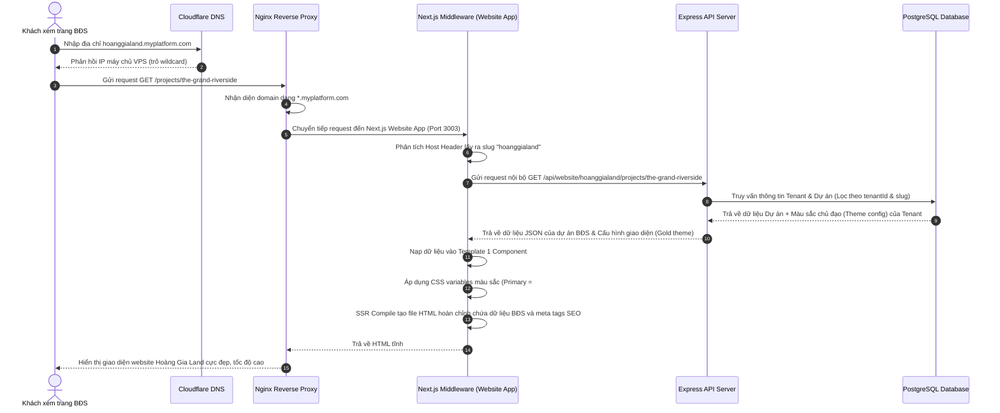
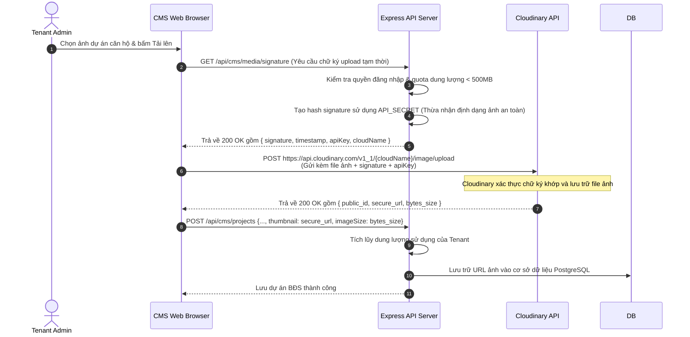
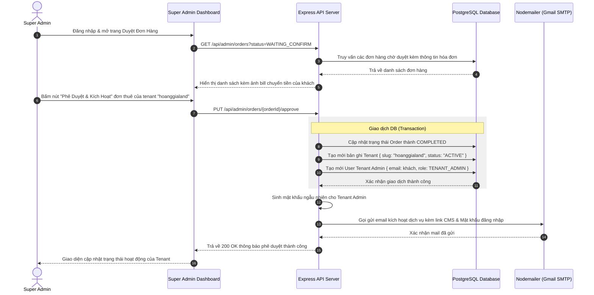

# 09. Sequence Diagrams

> Tài liệu này mô tả chi tiết các biểu đồ trình tự (Sequence Diagrams) biểu diễn các tương tác kỹ thuật ở mức độ sâu giữa Client, Next.js Middleware, Express Backend API, PostgreSQL Database và các dịch vụ bên thứ ba (Cloudinary, Email).

---

## 1. Cơ chế xác thực Token kép & Refresh Token Rotation

Quy trình quản lý phiên đăng nhập an toàn, bảo vệ Access Token trong cookie httpOnly và tự động cấp lại thông qua Refresh Token.

---

## 2. Định tuyến Subdomain động và nạp Selected Theme (SSR Website Load)

Quy trình Next.js Middleware chặn request, phân tích subdomain của tenant, nạp dữ liệu cấu hình giao diện và render phía Server (SSR) để tối ưu điểm SEO.

---

## 3. Quy trình tải ảnh an toàn qua Presigned Signature (Client -> Backend -> Cloudinary)

Quy trình giúp giấu kín mã bảo mật `API_SECRET` của Cloudinary ở Backend bằng cách sinh chữ ký số tạm thời cho Client upload trực tiếp.

---

## 4. Quy trình duyệt đơn hàng thuê và kích hoạt Tenant mới tự động

Quy trình quản lý đơn hàng thủ công nhưng kích hoạt tự động toàn bộ hạ tầng phần mềm cho khách thuê.

