# 17. Sprint Planning

> Tài liệu này vạch ra kế hoạch triển khai chi tiết theo từng ngày (Day-by-Day) cho hai Sprint cốt lõi: Sprint 1 (Phase 1 - MVP 7 Ngày) và Sprint 2 (Phase 2 - Mở rộng 7 Ngày). Kế hoạch này tối ưu hóa năng suất làm việc của 1 Developer kết hợp với sức mạnh bổ trợ của AI (AI-assisted coding).

---

## 🏃‍♂️ SPRINT 1: Phase 1 (MVP - Từ Ngày 1 Đến Ngày 7)

- **Mục tiêu chính:** Hoàn thành và chạy thực tế hệ thống Marketplace BĐS, luồng Mua/Thuê thủ công, trang CMS cho Tenant quản lý Dự án & Bài viết, Template 1 (Luxury Gold) hoạt động trên subdomain của 1 VPS.

```mermaid
gantt
    title Sprint 1 - MVP 7 Ngày
    dateFormat  DD
    axisFormat %d
    section Setup & DB
    Ngày 1 :active, 01, 01
    section Backend API
    Ngày 2 : 02, 02
    Ngày 3 : 03, 03
    section Frontend Marketplace & CMS
    Ngày 4 : 04, 04
    Ngày 5 : 05, 05
    section Website & Routing
    Ngày 6 : 06, 06
    section Deployment & UAT
    Ngày 7 : 07, 07
```

### Chi tiết kế hoạch từng ngày

#### 📅 Ngày 1: Setup Workspace & Thiết kế Database
- **Tác vụ thực hiện:** TS-01, TS-02, TS-03, TS-04, DB-01, DB-02.
- **Mục tiêu đạt được (Deliverables):**
  - Khởi tạo monorepo hoàn chỉnh, cấu hình TypeScript strict mode, ESLint và Prettier thống nhất.
  - Đồng bộ thành công cơ sở dữ liệu PostgreSQL cục bộ qua Prisma Migration.
- **Tiêu chí hoàn thành (DoD):**
  - Run lệnh `pnpm install` và `pnpm build` ở root monorepo không phát sinh bất kỳ lỗi lint hay compile nào.
  - Kết nối thành công tới DB từ Prisma Studio.

#### 📅 Ngày 2: Core Backend API & Hệ thống Auth
- **Tác vụ thực hiện:** BE-01, BE-02, BE-03, BE-04, BE-05, BE-06.
- **Mục tiêu đạt được (Deliverables):**
  - Viết xong logic đăng ký, đăng nhập và middleware bảo mật xác thực JWT lưu tại HttpOnly Cookie.
  - Trình xoay vòng token hoạt động bình thường trên Postman.
- **Tiêu chí hoàn thành (DoD):**
  - Các API `/api/auth/*` được test thông qua Postman đạt 100% tỷ lệ phản hồi mong muốn (200 OK cho happy path, 400/401 cho lỗi).
  - Cookie JWT được thiết lập thuộc tính `httpOnly`, `Secure` chính xác.

#### 📅 Ngày 3: Tenant Isolation & API Mua/Thuê
- **Tác vụ thực hiện:** BE-07, BE-08, BE-09, BE-10, DB-03.
- **Mục tiêu đạt được (Deliverables):**
  - Middleware cách ly dữ liệu Tenant được tích hợp.
  - Hoàn tất API ghi nhận đơn hàng Mua/Thuê thủ công kèm theo file ảnh hóa đơn chuyển tiền gửi lên Cloudinary.
  - Seed dữ liệu mẫu (3 tenant, 20 dự án, 20 bài viết, 10 banner) vào DB.
- **Tiêu chí hoàn thành (DoD):**
  - Chạy thử lệnh `pnpm db:seed` thành công không lỗi.
  - Test API ghi nhận ảnh hóa đơn và lưu trữ URL Cloudinary vào bảng `Order` thành công.

#### 📅 Ngày 4: CMS Tenant API & CMS Giao diện cơ bản
- **Tác vụ thực hiện:** BE-11, BE-12, BE-13, FTC-01, FTC-02, FTC-03.
- **Mục tiêu đạt được (Deliverables):**
  - API CRUD Dự án BĐS (27 trường) và Bài viết của Tenant hoạt động trơn tru.
  - Dựng xong khung giao diện CMS, bảng danh sách dự án của tenant và trang Dashboard CMS cơ bản.
- **Tiêu chí hoàn thành (DoD):**
  - Đăng nhập tài khoản Tenant Admin vào trang CMS hiển thị đúng thông tin thống kê dự án của chính tenant đó, không hiển thị lộn xộn dữ liệu của tenant khác.

#### 📅 Ngày 5: Hoàn thiện CMS Form & Giao diện Marketplace
- **Tác vụ thực hiện:** FTC-04, FTC-05, FTC-06, FTM-01, FTM-02, FTM-03, FTM-04, FTM-05, FTM-06, FTM-07, FTM-08.
- **Mục tiêu đạt được (Deliverables):**
  - Hoàn tất form thêm mới/sửa dự án BĐS tích hợp kéo thả ảnh và Zod schema validation.
  - Hoàn thành giao diện Marketplace công khai (Trang chủ, Danh sách Template, Chi tiết và Form đăng ký thuê kèm bill).
- **Tiêu chí hoàn thành (DoD):**
  - Khách truy cập vào Marketplace, chọn template, điền form thanh toán, tải lên ảnh bill thành công mà không cần code backend hỗ trợ nào khác ngoài các API đã xây dựng.

#### 📅 Ngày 6: Template 1 (Luxury Gold) & Subdomain Routing
- **Tác vụ thực hiện:** FTW-01, FTW-02, FTW-03, FTW-04, FTW-05, FTW-06, INT-01, INT-02.
- **Mục tiêu đạt được (Deliverables):**
  - Viết xong Template 1 hoàn chỉnh với phong cách Luxury Gold (White/Gold/Dark Navy).
  - Next.js middleware chặn và định tuyến động chính xác subdomain (ví dụ: `hoanggialand.localhost:3000` hiển thị đúng website của Hoàng Gia Land).
- **Tiêu chí hoàn thành (DoD):**
  - Khi trỏ file hosts local và truy cập `hoanggialand.localhost:3000` và `zenhomes.localhost:3000` hiển thị 2 website hoàn toàn khác nhau về nội dung (logo, dự án, bài viết) nhưng cùng bố cục của Template 1.

#### 📅 Ngày 7: Super Admin Panel, Triển khai VPS & UAT
- **Tác vụ thực hiện:** BE-14, BE-15, BE-16, BE-17, FTA-01, FTA-02, FTA-03, DEP-01, DEP-02, DEP-03, DEP-04.
- **Mục tiêu đạt được (Deliverables):**
  - Dựng Super Admin Panel để duyệt đơn hàng (kèm xem ảnh hóa đơn) và quản trị tenant.
  - Viết script gửi mail SMTP xác nhận tự động.
  - Đóng gói Docker Compose, đưa ứng dụng lên VPS thực tế, kết nối Cloudflare và trỏ SSL.
- **Tiêu chí hoàn thành (DoD):**
  - Quy trình chạy thử thực tế thành công: Vào `www.domain.com` -> Đăng ký thuê -> Xem thông tin CK -> Upload bill -> Vào Super Admin duyệt -> Nhận email mật khẩu CMS -> Vào CMS cập nhật dự án -> Subdomain tenant hoạt động ngay lập tức với giao diện bảo mật HTTPS.

---

## 🏃‍♂️ SPRINT 2: Phase 2 (Mở rộng & Nâng cao - Từ Ngày 8 Đến Ngày 14)

- **Mục tiêu chính:** Bổ sung 2 templates mới (Modern Dark và Minimal White), viết engine tùy biến Demo (giới hạn 3 lần lưu / 3 ngày), quản lý Banner, Menu, Form liên hệ động trong CMS, tích hợp tải ZIP trực tiếp, tự động hóa gửi email qua Resend và hỗ trợ ánh xạ tên miền riêng (custom domain).

### Chi tiết kế hoạch từng ngày

- **Ngày 8:** Xây dựng backend quản trị Demo (giới hạn 3 lần lưu / 3 ngày) (BE-18, BE-19).
- **Ngày 9:** Phát triển module Quản lý Banner & Menu Builder dạng cây thư mục trong CMS (BE-20, BE-21, FTC-07, FTC-08).
- **Ngày 10:** Phát triển Template 2 (Modern Dark - Đen sang trọng kết hợp màu neon) (FTW-07).
- **Ngày 11:** Phát triển Template 3 (Minimal White - Tối giản tinh tế, font chữ Outfit) (FTW-08).
- **Ngày 12:** Tích hợp hiển thị Banner & Menu động lên cả 3 template. Xây dựng giao diện xem liên hệ khách hàng gửi về (BE-22, FTC-09, FTW-09).
- **Ngày 13:** Tích hợp tải file ZIP trực tiếp từ Dashboard khi mua source code. Chuyển dịch mail SMTP sang Resend API (BE-23, FTC-10, FTA-04).
- **Ngày 14:** Triển khai API liên kết Custom Domain, cấu hình động Nginx/Cloudflare DNS và thiết lập luồng CI/CD qua GitHub Actions (BE-24, FTA-05, DEP-05, TST-01, TST-02).
