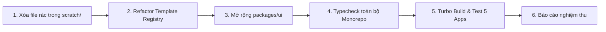

# CLEANUP & CODE REFACTORING PLAN — PLATFORMBDS V2

**Date:** 2026-08-23  
**Auditor:** Principal Software Architect & DevOps Engineer  
**Policy:** SAFE STEP-BY-STEP REFACTORING — ZERO DOWNTIME — NO REGRESSION

---

## 1. Phân Loại Chi Tiết (KEEP / REFACTOR / MOVE / REMOVE / CREATE)

### 🟢 1.1 NHỮNG GÌ GIỮ NGUYÊN (KEEP)
* **Toàn bộ 5 Ứng Dụng Cốt Lõi**:
  * `apps/marketplace` (:3000)
  * `apps/cms` (:3001)
  * `apps/admin` (:3002)
  * `apps/website` (:3003)
  * `apps/api` (:5000)
* **Toàn bộ 4 Packages Nội Bộ**:
  * `packages/database` (Prisma schema 38 models, migrations, client)
  * `packages/types` (TypeScript interfaces & enums)
  * `packages/utils` (Tiện ích định dạng, bảng màu, địa chỉ)
  * `packages/ui` (Thư viện UI)
* **Toàn bộ 16 Mẫu Template BĐS**:
  * `apps/website/src/components/templates/*.tsx` (16 giao diện BĐS cao cấp)
* **Cấu hình Triển khai & Môi trường**:
  * `docker-compose.yml`, `docker-compose.prod.yml`, `pnpm-workspace.yaml`, `turbo.json`, `.env.example`.

---

### 🟡 1.2 NHỮNG GÌ CẦN TỐI ƯU HÓA (REFACTOR)
* **`apps/website/src/components/TenantRenderer.tsx`**:
  * Thay thế khối `switch (slug)` cũ bằng **`WebsiteTemplateRegistry`** giúp hệ thống mở rộng lên 100+ template dễ dàng.
* **`packages/ui`**:
  * Mở rộng thêm các Shared UI Components (`ProjectCard`, `ProjectGrid`, `BlogCard`, `ContactForm`, `LeadForm`, `HeroSection`, `AboutSection`, `GalleryGrid`).
* **`apps/api/src/controllers/cms.builder.controller.ts`**:
  * Củng cố cơ chế Atomic Transaction cho Quota Save và Whitelist trường dữ liệu được phép chỉnh sửa.
* **`apps/marketplace/src/components/Header.tsx` & `Footer.tsx`**:
  * Đồng bộ hotline phụ `0983 312 219` và nút đăng nhập CMS.

---

### 🔵 1.3 NHỮNG GÌ TẠO MỚI (CREATE)
* **`apps/website/src/templates/registry.ts`**:
  * Module đăng ký tập trung cho 100+ Templates.
* **`packages/ui/src/components/`**:
  * Các thành phần giao diện dùng chung cho tất cả các template.
* **`scripts/build-delivery-package.ts`**:
  * Pipeline tự động tạo gói bàn giao Web Tĩnh (`public_html/`) cho khách mua source.

---

### 🔴 1.4 NHỮNG GÌ DỌN DẸP / LOẠI BỎ (REMOVE)
* **Các file log tạm và script nháp cũ không còn tham chiếu trong `scratch/`**:
  * `scratch/build_all.log`, `scratch/build_website.log`
  * `scratch/check_accounts.js`, `scratch/find_lint_file.js`, `scratch/find_quotes.js`, `scratch/fix_templates.js`
  * `scratch/inspect_*.js` (các script test giao diện cũ trong quá trình phát triển)
* **Các file trùng lặp cũ**:
  * Đảm bảo không còn endpoint test hoặc hardcoded credentials trong source code.

---

## 2. Quy Trình Thực Thi Dọn Dẹp An Toàn

