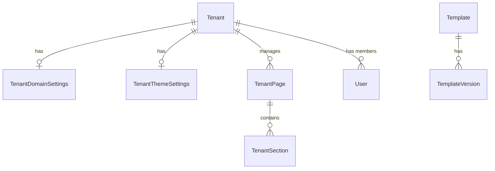
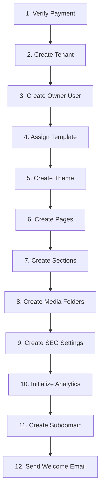

# PLATFORMBDS ENTERPRISE SAAS ARCHITECTURE BIBLE
Version: 1.0.0
Author: Principal Software Architect & Solution Architect

Chào mừng bạn đến với tài liệu Kiến trúc Hệ thống chuẩn Enterprise của PlatformBDS - Nền tảng SaaS phân phối và quản lý mẫu thiết kế (Web Templates) bất động sản chuyên nghiệp tương tự Shopify, Wix và Webflow.

Tài liệu này đóng vai trò là kim chỉ nam tối cao cho việc thiết kế, vận hành, bảo mật và phát triển hệ thống.

---

## MỤC LỤC

1. [MÔ HÌNH KINH DOANH (BUSINESS MODEL)](#1-mô-hình-kinh-doanh-business-model)
2. [KIẾN TRÚC HỆ THỐNG (SAAS ARCHITECTURE)](#2-kiến-trúc-hệ-thống-saas-architecture)
3. [KIẾN TRÚC MULTI-TENANT (MULTI-TENANT ARCHITECTURE)](#3-kiến-trúc-multi-tenant-multi-tenant-architecture)
4. [THIẾT KẾ CƠ SỞ DỮ LIỆU (DATABASE DESIGN)](#4-thiết-kế-cơ-sở-dữ-liệu-database-design)
5. [CƠ CHẾ RENDER (TEMPLATE ENGINE)](#5-cơ-chế-render-template-engine)
6. [TEMPLATE STUDIO](#6-template-studio)
7. [TENANT CMS](#7-tenant-cms)
8. [HỆ THỐNG THANH TOÁN & WORKFLOW KÍCH HOẠT (PAYMENT & ONBOARDING)](#8-hệ-thống-thanh-toán--workflow-kích-hoạt-payment--onboarding)
9. [QUẢN LÝ TÊN MIỀN (DOMAIN MANAGER)](#9-quản-lý-tên-miền-domain-manager)
10. [QUẢN LÝ PHIÊN BẢN (VERSION MANAGER)](#10-quản-lý-phiên-bản-version-manager)
11. [QUẢN LÝ MEDIA (MEDIA MANAGER)](#11-quản-lý-media-media-manager)
12. [HỆ THỐNG PHÂN QUYỀN (PERMISSION SYSTEM)](#12-hệ-thống-phân-quyền-permission-system)
13. [BẢO MẬT HỆ THỐNG (SECURITY)](#13-bảo-mật-hệ-thống-security)
14. [VẬN HÀNH HỆ THỐNG (DEVOPS)](#14-vận-hành-hệ-thống-devops)
15. [DEPLOYMENT & TRIỂN KHAI](#15-deployment--triển-khai)
16. [ROADMAP PHÁT TRIỂN HỆ THỐNG](#16-roadmap-phát-triển-hệ-thống)

---

## 1. MÔ HÌNH KINH DOANH (BUSINESS MODEL)

PlatformBDS là giải pháp B2B2C cung cấp hệ sinh thái thiết kế website bất động sản.

### 1.1. Các Gói Đăng Ký (Subscription Plans)
Hệ thống phân cấp tính năng theo 3 gói chính:
- **Starter (299.000 đ/tháng)**: Khởi tạo 1 website, sử dụng subdomain, giới hạn 5 trang tĩnh và 50 dự án. Không cho phép đổi Footer, không có Custom API.
- **Pro (699.000 đ/tháng)**: Cho phép kết nối tên miền riêng, không giới hạn trang, hỗ trợ SEO nâng cao, CRM Leads quản trị và tích hợp Chatbot Zalo/Facebook.
- **Enterprise (Thỏa thuận)**: Băng thông không giới hạn, tích hợp API CRM ngoài, báo cáo Analytics chuyên sâu, thiết kế layout tùy biến riêng biệt và có nhân viên hỗ trợ 24/7.

### 1.2. Cơ chế Giá bù trừ (Proration Engine)
Khi khách thuê thực hiện nâng cấp gói dịch vụ (Ví dụ: Từ Starter lên Pro) giữa chu kỳ thanh toán, hệ thống chỉ tính phần chênh lệch chi phí dựa trên số ngày sử dụng thực tế còn lại. 

---

## 2. KIẾN TRÚC HỆ THỐNG (SAAS ARCHITECTURE)

PlatformBDS áp dụng mô hình **Monorepo** được quản lý bởi **Turborepo** nhằm tối ưu chia sẻ kiểu dữ liệu và cấu hình giữa các ứng dụng.

### 2.1. Sơ đồ Cấu trúc Dự án
```
PlatformBDS (Monorepo)
├── apps
│   ├── admin        # Portal dành cho Super Admin (Next.js)
│   ├── cms          # CMS dành cho Khách thuê (Next.js)
│   ├── marketplace  # Chợ mua bán giao diện (Next.js)
│   ├── website      # Website Runtime hiển thị ngoài (Next.js)
│   └── api          # Backend API dùng chung (Express.js + Node)
└── packages
    ├── database     # Cấu hình Prisma và Template Registry
    ├── tsconfig     # Cấu hình TypeScript dùng chung
    └── ui           # Bộ thư viện UI dùng chung
```

---

## 3. KIẾN TRÚC MULTI-TENANT (MULTI-TENANT ARCHITECTURE)

Hệ thống áp dụng kiến trúc **Single Database, Shared Schema** cô lập dữ liệu logic bằng khóa ngoại `tenantId`.

### 3.1. Phân giải Host động (Domain Routing)
Không deploy website mới cho từng khách thuê. Khi một yêu cầu HTTP gửi đến Website Runtime, Next.js Edge Middleware sẽ phân tích tiêu đề `host`:
1. Trích xuất subdomain (ví dụ: `luxury.platformbds.vn` $\rightarrow$ tenant slug là `luxury`).
2. Nếu là custom domain (`dinhthu.vn`), middleware gọi API nội bộ `/api/website/resolve-domain` để đối chiếu cơ sở dữ liệu và lấy ra tenant tương ứng.
3. Gắn `x-tenant-slug` vào header yêu cầu để ứng dụng render dữ liệu phù hợp.

---

## 4. THIẾT KẾ CƠ SỞ DỮ LIỆU (DATABASE DESIGN)

Sử dụng PostgreSQL để lưu trữ thông tin có cấu trúc chặt chẽ.



### 4.1. Index Chiến lược
Thiết lập Composite Index trên các trường truy vấn tần suất cao:
- `@@index([tenantId, slug])` trên bảng `TenantPage`.
- `@@index([tenantId, pageId])` trên bảng `TenantSection`.
- `@@unique([customDomain])` trên bảng `TenantDomainSettings` để tăng tốc độ phân giải tên miền.

---

## 5. CƠ CHẾ RENDER (TEMPLATE ENGINE)

Template Engine đọc cấu hình JSON lưu trữ trong database và chuyển đổi thành giao diện React hoàn chỉnh.

### 5.1. Dữ liệu đầu vào (JSON Config)
Một phần đoạn giao diện được lưu dưới dạng cấu hình:
```json
{
  "sectionKey": "hero",
  "content": {
    "title": "Dinh Thự Vinhomes Grand Park",
    "subtitle": "Đẳng cấp sống thượng lưu"
  },
  "settings": {
    "primaryColor": "#D4AF37",
    "paddingY": "lg"
  }
}
```

### 5.2. Chặn tiêm mã nguồn (XSS Protection)
Để đảm bảo an toàn tuyệt đối, hệ thống thực thi xác thực chặt chẽ đầu vào:
- Chặn tất cả thẻ `<script>`, `<iframe/>`, biểu thức `javascript:` hoặc thuộc tính kích hoạt sự kiện HTML (như `onload`, `onerror`).
- Dữ liệu trước khi hiển thị trên Website Runtime được mã hóa qua các hàm lọc ký tự đặc biệt.

---

## 6. TEMPLATE STUDIO

Phân hệ dành riêng cho Super Admin thiết kế mẫu thiết kế gốc.

### 6.1. Thành phần
- **Navigator**: Hiển thị cấu trúc dạng cây của các trang, phân đoạn và khối thành phần.
- **Canvas**: Hiển thị website thời gian thực dưới dạng iframe, hỗ trợ giao tiếp postMessage để cập nhật giao diện lập tức khi kéo thả.
- **Inspector**: Panel bên phải cho phép tinh chỉnh các biến Theme (Màu sắc, phông chữ, bo góc) và nội dung chữ/ảnh.

---

## 7. TENANT CMS

Trang quản trị độc lập dành cho Khách thuê.

### 7.1. Giới hạn Quyền Hạn
Khách thuê tuyệt đối **KHÔNG** có quyền can thiệp vào:
- Mã nguồn React/JSX.
- Lớp CSS Tailwind thô.
- Cấu trúc tệp tin Layout tĩnh.
- Engine hiển thị.
Khách chỉ được phép biên tập: Nội dung bài viết (Blog), Danh sách bất động sản (Projects), Cấu hình màu sắc/font chữ thông qua giao diện thiết kế kéo thả an toàn.

---

## 8. HỆ THỐNG THANH TOÁN & WORKFLOW KÍCH HOẠT (PAYMENT & ONBOARDING)

Quy trình tự động hóa kích hoạt dịch vụ sau khi giao dịch thanh toán được xác nhận thành công.

### 8.1. Quy trình kích hoạt (Onboarding Workflow)


Toàn bộ quy trình từ bước 1 đến bước 11 được thực thi trong một **Prisma Database Transaction**. Nếu có bất kỳ bước nào phát sinh lỗi (Ví dụ: Trùng lặp subdomain, lỗi ghi cơ sở dữ liệu), giao dịch sẽ lập tức rollback để bảo toàn tính nhất quán. Email chào mừng chỉ được gửi sau khi transaction commit thành công.

---

## 9. QUẢN LÝ TÊN MIỀN (DOMAIN MANAGER)

Hệ thống cho phép khách thuê cấu hình tên miền riêng chuyên nghiệp.

### 9.1. Xác thực DNS (DNS Verification)
Hệ thống sử dụng thư viện `dns` của Node.js để kiểm tra bản ghi:
- **CNAME**: Custom domain trỏ về `subdomain.platformbds.vn`.
- **A Record**: Custom domain trỏ về địa chỉ IP tĩnh của máy chủ.

### 9.2. Tích hợp SSL & Cloudflare
Khi tên miền được xác thực DNS thành công, hệ thống gọi API Cloudflare để tạo bản ghi SSL, bật proxy giảm tải (CDN) và cập nhật trạng thái SSL thành `ACTIVE`.

---

## 10. QUẢN LÝ PHIÊN BẢN (VERSION MANAGER)

Hệ thống phiên bản chuẩn Enterprise cho các mẫu website.

### 10.1. Vòng đời Phiên bản (Version Lifecycle)
```
[Draft (Nháp)] ──> [Published (Xuất Bản)] ──> [Archived (Lưu Trữ)]
      ^                                            
      └───────── [Rollback (Khôi Phục)] ───────────┘
```

### 10.2. Nâng cấp Không mất dữ liệu (Data-safe Migration)
Khi Super Admin nâng cấp mẫu Luxury Gold từ `v1.0` lên `v1.1`, hệ thống chạy các luật di cư (`migrationRules`) định nghĩa sẵn tại `TemplateRegistry`. Quá trình này chỉ bổ sung các thuộc tính thiết kế mới, tuyệt đối không can thiệp hay xóa bỏ dữ liệu bài viết, dự án, hoặc thông tin do khách thuê tự nhập.

---

## 11. QUẢN LÝ MEDIA (MEDIA MANAGER)

Lưu trữ và tổ chức tệp tin hình ảnh, video của khách thuê.

### 11.1. Kiến trúc lưu trữ
Tất cả ảnh tải lên được đẩy lên Object Storage (S3 / Cloudinary) thông qua API trung gian xác thực kích thước và định dạng tệp tin (Chỉ cho phép `.jpg, .png, .webp`). 

---

## 12. HỆ THỐNG PHÂN QUYỀN (PERMISSION SYSTEM)

Hệ thống phân chia 3 vai trò rõ rệt:
- **Super Admin (Quản trị hệ thống)**: Toàn quyền truy cập, tạo mẫu thiết kế, duyệt đơn hàng và di cư hệ thống.
- **Tenant Owner (Chủ website)**: Quản lý toàn bộ cấu hình website con, thêm bớt biên tập viên, cấu hình thanh toán và kết nối tên miền.
- **Editor (Biên tập viên)**: Chỉ có quyền thêm, sửa bài viết, dự án và tiếp nhận thông tin leads gửi về từ biểu mẫu liên hệ.

---

## 13. BẢO MẬT HỆ THỐNG (SECURITY)

Lớp bảo vệ đa tầng cho nền tảng SaaS.

### 13.1. Các kỹ thuật áp dụng
- **JWT**: Sử dụng Access Token thời gian ngắn (15 phút) lưu trong cookie và Refresh Token (7 ngày) lưu trong HttpOnly Cookie để tránh tấn công XSS đánh cắp token.
- **CSRF Token**: Bắt buộc gửi kèm mã `X-CSRF-Token` cho tất cả yêu cầu thay đổi trạng thái (POST, PUT, DELETE).
- **Rate Limiting**: Giới hạn 100 yêu cầu/phút với API thường và tối đa 5 yêu cầu/giờ đối với biểu mẫu gửi liên hệ từ khách truy cập.

---

## 14. VẬN HÀNH HỆ THỐNG (DEVOPS)

Sử dụng Docker để đóng gói ứng dụng đồng bộ trên các môi trường.

### 14.1. Docker Compose Quy Chuẩn
```yaml
version: '3.8'
services:
  postgres:
    image: postgres:15
    environment:
      POSTGRES_DB: real_estate_platform
  api:
    build:
      context: .
      dockerfile: ./apps/api/Dockerfile
  website:
    build:
      context: .
      dockerfile: ./apps/website/Dockerfile
```

---

## 15. DEPLOYMENT & TRIỂN KHAI

### 15.1. Mô hình CDN & Reverse Proxy
Nginx hoạt động như một reverse proxy tiếp nhận toàn bộ yêu cầu, phân luồng SSL động và chuyển tiếp yêu cầu tới Website Runtime hoặc CMS phù hợp.

---

## 16. ROADMAP PHÁT TRIỂN HỆ THỐNG

### Các giai đoạn chính:
1. **Giai đoạn 1**: Hoàn thiện Core SaaS, Multi-tenant routing và CMS cơ bản.
2. **Giai đoạn 2**: Tích hợp Template Studio kéo thả nâng cao và hệ thống phiên bản.
3. **Giai đoạn 3**: Triển khai Domain Manager tự động hóa hoàn toàn với Cloudflare SSL và cổng thanh toán quốc tế.
4. **Giai đoạn 4**: Tích hợp Trí tuệ nhân tạo (AI Writer) tự động tạo nội dung mô tả dự án bất động sản.
