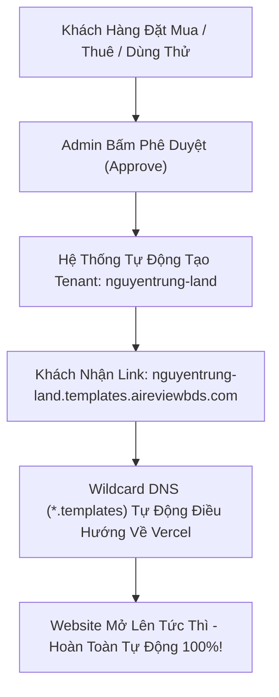

# 🌐 Hướng Dẫn Cấu Hình Wildcard Subdomain (`*.templates.aireviewbds.com`)

> ⚠️ **LƯU Ý QUAN TRỌNG NHẤT:**  
> Bạn chỉ cần làm 2 bước bên dưới **ĐÚNG 1 LẦN DUY NHẤT**.  
> Ký tự đại diện dấu sao (`*`) sẽ tự động bao quát cho **TẤT CẢ** khách hàng sau này (10 khách, 1.000 khách hay 100.000 khách). Khi có khách mua/thuê mới, bạn **KHÔNG** cần phải vào lại DNS hay Vercel để thêm domain nữa!

---

## 📋 Checklist Các Bước Cấu Hình (Làm 1 Lần Duy Nhất)

### ⬜ Bước 1: Cấu hình DNS tại Nhà Cung Cấp Domain (Cloudflare / Matbao / Namecheap / PA Vietnam...)

1. Đăng nhập vào trang quản lý Domain `aireviewbds.com`.
2. Tìm đến mục **DNS Management** (hoặc **Quản lý bản ghi DNS** / **DNS Records**).
3. Bấm **Thêm bản ghi mới (Add Record)** và điền chính xác:
   - **Type (Loại bản ghi):** `CNAME`
   - **Name / Host (Tên máy chủ):** `*.templates`
   - **Target / Value (Giá trị / Đích đến):** `cname.vercel-dns.com`
   - **TTL:** Để `Auto` (hoặc `3600` / `Mặc định`)
4. ⚠️ **Nếu bạn dùng Cloudflare:**
   - Tại cột **Proxy status**: Chuyển đám mây màu **Cam (Proxied)** sang màu **Xám (DNS Only)**.
   - *Lý do:* Bật đám mây cam sẽ chặn cơ chế cấp chứng chỉ SSL Wildcard tự động nhiều cấp của Vercel.

---

### ⬜ Bước 2: Thêm Wildcard Domain vào Vercel Project `bds-template-website`

1. Đăng nhập vào [Vercel Dashboard](https://vercel.com/dashboard).
2. Chọn đúng Project: **`bds-template-website`** (Project hiển thị website khách hàng).
3. Vào **Settings** ➔ chọn mục **Domains** ở menu bên trái.
4. Tại ô nhập domain, gõ chính xác:
   ```text
   *.templates.aireviewbds.com
   ```
5. Bấm nút **Add**.
6. Đợi 10 - 30 giây để Vercel xác thực bản ghi DNS:
   - ✅ Khi xuất hiện chữ **Valid Configuration** kèm **dấu tick tròn màu xanh** là thành công 100%.

---

## 🔍 Bước 3: Cách Tự Kiểm Tra Đã Chạy Đúng Chưa

1. **Kiểm tra lan truyền DNS:**
   - Truy cập trang web: [whatsmydns.net](https://www.whatsmydns.net)
   - Nhập một tên miền ngẫu nhiên bất kỳ, ví dụ: `test-check.templates.aireviewbds.com`
   - Chọn loại record `CNAME` ➔ bấm **Search**.
   - Nếu hầu hết các địa điểm trên thế giới đều trả về `cname.vercel-dns.com` kèm dấu tick xanh lá là DNS đã hoạt động hoàn hảo.
2. **Kiểm tra trực tiếp trên trình duyệt:**
   - Mở trình duyệt và truy cập thử link: `https://demo-test.templates.aireviewbds.com`
   - Kết quả mong đợi:
     - 🔒 Có **ổ khóa bảo mật SSL** (không báo lỗi đỏ "Not Secure").
     - 📄 Hiển thị trang giao diện website hoặc trang 404 chỉn chu của hệ thống (thay vì lỗi trình duyệt `DNS_PROBE_FINISHED_NXDOMAIN`).

---

## 🛠️ Bảng Khắc Phục Lỗi Thường Gặp

| Hiện Tượng Lỗi | Nguyên Nhân Phổ Biến | Cách Xử Lý Nhanh |
|---|---|---|
| **`DNS_PROBE_FINISHED_NXDOMAIN`** (Trình duyệt báo không tìm thấy trang web) | 1. Chưa thêm bản ghi CNAME `*.templates`.<br>2. Nhập nhầm Host (ví dụ gõ nhầm thành `*.templates.aireviewbds.com` trong khi nhà cung cấp chỉ yêu cầu gõ `*.templates`).<br>3. DNS vừa thêm chưa kịp cập nhật (đợi 5 - 15 phút). | Kiểm tra lại bảng DNS tại nhà cung cấp domain, đảm bảo Host là `*.templates` và Target trỏ về `cname.vercel-dns.com`. |
| **`Not Secure` / Chứng chỉ SSL không hợp lệ** | 1. Đang bật đám mây cam (Proxy) trên Cloudflare.<br>2. Vercel đang trong quá trình generate chứng chỉ SSL (thường mất 1 - 2 phút lần đầu). | 1. Vào Cloudflare chuyển sang **DNS Only (Đám mây xám)**.<br>2. Vào Vercel Project Settings ➔ Domains ➔ bấm nút **Refresh** để cấp lại chứng chỉ. |
| **Vercel báo "Invalid Configuration" (Dấu chấm than đỏ)** | 1. Trỏ sai Target (phải là `cname.vercel-dns.com`).<br>2. Domain gốc `aireviewbds.com` đang dùng Nameserver của đơn vị khác với nơi bạn vừa sửa bản ghi. | Đối chiếu lại xem Domain đang quản lý DNS ở đâu (Cloudflare hay trang quản trị nhà đăng ký) và cấu hình đúng tại nơi đó. |

---

## 🎯 Tóm Tắt Luồng Vận Hành Tự Động Sau Khi Cấu Hình Xong



> **Ghi nhớ:** Sau khi hoàn thành checklist này, mọi khách hàng tương lai được duyệt đều sẽ có website chạy ngay lập tức mà bạn không bao giờ phải chạm tay vào cấu hình hạ tầng nữa!
